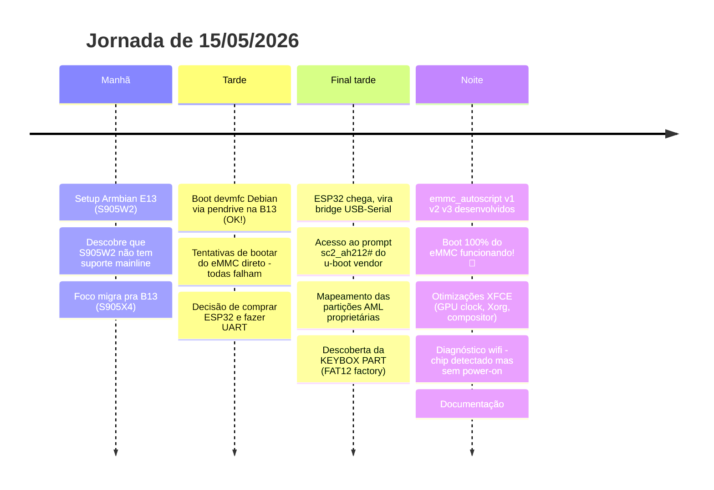
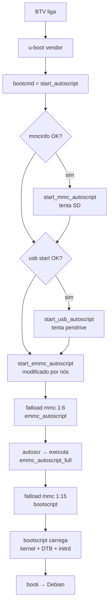

# Diário Técnico — AmlBoot B13

> Engenharia reversa do bootloader vendor de uma TV Box BTV B13 (Amlogic S905X4) pra rodar Debian 13 autônomo do eMMC interno, mais otimizações da stack gráfica e diagnóstico do chip wifi.
>
> **Autor:** Gabriel Lima
> **Data:** 15 de maio de 2026
> **Sessão:** ~12 horas, com assistência de Claude (Anthropic)
> **Status final:** Boot autônomo funcionando ✅ • XFCE otimizado ✅ • WiFi pendente ❌

---

## Sumário

1. [Resumo executivo](#1-resumo-executivo)
2. [Hardware](#2-hardware)
3. [Linha do tempo](#3-linha-do-tempo)
4. [E13 (S905W2) — dead end](#4-e13-s905w2--dead-end)
5. [B13 (S905X4) — caminho até o boot autônomo](#5-b13-s905x4--caminho-até-o-boot-autônomo)
6. [Otimizações XFCE](#6-otimizações-xfce)
7. [WiFi — diagnóstico até onde foi](#7-wifi--diagnóstico-até-onde-foi)
8. [Pendências e planos](#8-pendências-e-planos)
9. [Lições aprendidas](#9-lições-aprendidas)
10. [Anexos](#10-anexos)

---

## 1. Resumo executivo

Comecei a sessão querendo instalar Armbian numa TV Box BTV E13 (chip S905W2). O suporte mainline do S905W2 (família Meson S4) é experimental — wifi, IR e som não funcionam mesmo no CoreELEC. Migrei o foco pra uma segunda TV Box, a BTV B13 (chip **Amlogic S905X4**, família SC2), que tem suporte muito mais maduro.

Na B13, consegui um boot devmfc Debian Trixie via pendrive sem dor. O desafio real era fazer ela bootar **direto do eMMC interno** sem depender de pendrive — coisa que o u-boot vendor proprietário da Amlogic dificulta porque ele tem um layout de partições próprio (AML scheme) que não bate com a tabela MBR criada pelo Linux.

A solução veio em três grandes descobertas:

1. **Acesso ao u-boot vendor via UART** usando um ESP32 como adaptador serial (R$30)
2. **Sequestro da partição KEYBOX (factory partition, mmc 1:6)** que originalmente armazena chaves DRM — gravei um `emmc_autoscript` ali, que é o arquivo que o `start_emmc_autoscript` do u-boot vendor procura
3. **Descoberta de que a partição vendor "super" (mmc 1:15 hex) começa no mesmo setor que a FAT32 /boot criada pela MBR Linux** — isso permite o u-boot ler kernel/DTB direto da nossa partição sem entender MBR

Depois do boot autônomo funcionando, ataquei o XFCE engasgado. A causa real **não era CPU lenta** (Cortex-A35 a 1.8GHz é capaz) — era a **GPU Mali-G31 travada em 285 MHz** (3x menos que o máximo de 846 MHz) porque o devfreq governor padrão é tunado pra cargas de jogo, não pra UI. Forcei governor `performance`, ajustei Xorg pra usar DRI3 + PageFlip + glamor explicitamente, e religuei compositor XFWM4 com vsync. Resultado: XFCE fluido com tearing leve residual.

O wifi (chip MediaTek MT7668 SDIO) ficou pendente. Driver out-of-tree existe e carrega, mas o chip não responde com ID válido (`v0000d0000`) porque o DTB genérico "AH212 Development Board" não tem o nó específico do BTV B13 com GPIOs de power-on. Decisão pragmática: usar dongle USB WiFi (R$20).

---

## 2. Hardware

### Modelo principal: BTV B13

| Item | Detalhe |
|---|---|
| Modelo | BTV B13 |
| SoC | **Amlogic S905X4** (família SC2, Meson SC2) |
| CPU | 4× Cortex-A35 @ 1.8 GHz |
| GPU | Mali-G31 MP2 (Bifrost) |
| RAM | 2 GB DDR4 |
| Storage | 16 GB eMMC (Biwin, HS200, partição super 1.6GB + userdata 12GB) |
| Ethernet | Realtek 100 Mbps (alguns modelos 1 Gbps — confirma) |
| WiFi/BT | MediaTek MT7668 (chip combo wifi 2.4/5GHz + BT 5.0), via SDIO |
| HDMI | Out 2.0a 4K@60Hz (mas o display interno usa 1080p) |
| USB | 1× USB 3.0 + 1× USB 2.0 |
| Recovery button | Escondido na porta AV (RCA amarelo) — alfinete/toothpick |
| UART | Header de fábrica com pads SW/3V3/RX/TX/GND na placa |

### Modelo secundário: BTV E13

| Item | Detalhe |
|---|---|
| Modelo | BTV E13 V1.0 (data: 2022.06.02) |
| SoC | **Amlogic S905W2** (família Meson S4) |
| CPU | 4× Cortex-A35 |
| GPU | Mali-G31 |
| RAM | 2 GB |
| WiFi | Provavelmente SV6256P (Unisoc) — chip proprietário sem driver mainline |

O S905W2 (Meson S4) ainda não tem suporte sólido no kernel mainline em 2026. A imagem Armbian community "Aml-s9xx-box" não tem DTB nem u-boot pra esse chip — falhou em todos os testes de boot. Apenas o CoreELEC funcionou (DTB `s4_s905w2_2g.dtb` renomeado pra `dtb.img`), mas sem wifi nem IR.

### ESP32 (adaptador UART)

| Item | Detalhe |
|---|---|
| Modelo | Qualquer ESP32 dev board com UART2 acessível (GPIO16/17) |
| Custo | ~R$30 no Mercado Livre / AliExpress |
| Função | USB-Serial bridge entre PC e UART da BTV |
| Vantagem | 3.3V logic levels idênticos à BTV — conexão direta sem level shifter |

---

## 3. Linha do tempo



---

## 4. E13 (S905W2) — dead end

### Tentativas

Comecei tentando rodar Armbian community (`Armbian_community_26.2.0-trunk.858_Aml-s9xx-box_trixie_current_6.18.26_minimal.img.xz`) via pendrive com toothpick. Não bootou.

Funcionou só com CoreELEC (`CoreELEC-Amlogic-ne.aarch64-21.3-Omega-Generic.img.gz`), usando o DTB `s4_s905w2_2g.dtb` renomeado pra `dtb.img` na raiz do pendrive. Mas:

- **WiFi não funciona** (chip SV6256P/Unisoc sem driver)
- **IR receiver não funciona** (precisa DTB específico)
- **Áudio HDMI parcial** ("Most S905W2 boxes: No sound" — relatório oficial Armbian)

### Por que falhou

O **S905W2** é da família Meson S4. Diferente do S905W "normal" (família GXL/G12 antiga), o S4 é um chip relativamente novo (2022+) e o suporte no kernel mainline ainda é experimental:

- Sem u-boot mainline funcional pra S4
- DTBs específicos não existem na linha principal do kernel
- Drivers proprietários da Amlogic + Unisoc não estão empacotados

O projeto [devmfc/debian-on-amlogic](https://github.com/devmfc/debian-on-amlogic) lista o S905W2 como suportado experimentalmente, com perfis `tanixw2`, `h96maxw2` ou `s905w2_generic`. Consegui bootar Debian via pendrive com `box=s905w2_generic`, mas o estado final do E13 ficou:

✅ Boot via pendrive funciona
✅ SSH via ethernet OK
❌ WiFi
❌ Áudio HDMI
❌ IR
⚠️ Suporte experimental, qualquer kernel mais novo pode quebrar

**Decisão:** parar com o E13 por enquanto e focar na B13.

---

## 5. B13 (S905X4) — caminho até o boot autônomo

O S905X4 (família SC2) é dramaticamente melhor suportado. Boot pelo pendrive devmfc funcionou de primeira com `box=s905x4_generic_gigabit`.

### 5.1 O problema do boot do eMMC

O u-boot vendor proprietário da Amlogic não consegue bootar Linux do eMMC porque:

1. **Layout de partições AML é proprietário** — não usa MBR/GPT padrão
2. **`fatload mmc 1` retorna "Unrecognized filesystem type"** — não enxerga partições nossas
3. **Tabela é "via DTS"** — definida em device tree dentro do firmware vendor, hardcoded

### 5.2 ESP32 como adaptador UART

A B13 tem 4 pads UART expostos na placa: `SW`, `3V3`, `TX`, `RX` (numa ordem que varia). O ESP32 vira bridge USB-Serial:

```
ESP32 GND     ─── BTV GND
ESP32 GPIO16  ─── BTV TX    (UART2 RX do ESP32 escuta a BTV)
ESP32 GPIO17  ─── BTV RX    (UART2 TX do ESP32 envia pra BTV)
```

3.3V logic em ambos os lados — conexão direta, sem level shifter.

Baud: 115200 8N1.

Sketch básico:

```cpp
void setup() {
    Serial.begin(115200);
    Serial2.begin(115200, SERIAL_8N1, 16, 17);
}
void loop() {
    while (Serial2.available()) Serial.write(Serial2.read());
    while (Serial.available()) Serial2.write(Serial.read());
}
```

Sketch "v2" com auto-intercept disponível em `scripts/esp32-uart-bridge.ino` — detecta "Hit any key to stop autoboot" e manda Enter sozinho (a janela é muito curta pra digitar manualmente).

### 5.3 Acesso ao prompt vendor

Com ESP32 conectado e Serial Monitor a 115200 baud, ao ligar a BTV aparece:

```
sc2_ah212#
```

A B13 reporta-se internamente como `sc2_ah212` (referência ao SOM development board da Amlogic).

### 5.4 Mapeamento das partições vendor

Com `mmc part` no prompt vendor:

```
Partition Map for MMC device 1
Part   Start   Sectors   Size  Name
00         0      8192   4MB   bootloader
01     73728    131072  64MB   reserved
02    221184   1638400 800MB   cache
03   1875968     16384   8MB   env
04   1908736     65536  32MB   recovery
05   1990656      4096   2MB   frp
06   2011136     16384   8MB   factory       ← KEYBOX PART (FAT12)
07   2043904     49152  24MB   vendor_boot
08   2109440     65536  32MB   tee
09   2191360     16384   8MB   (bmeta)
20   2744320      4096   2MB   vbmeta_system
21   2764800   3276800 1.6GB   super         ← contém /boot FAT32 do Linux
22   6057984  24727552  12GB   userdata      ← contém rootfs ext4 do Linux
```

**Observação crítica**: as partições 21 e 22 começam em setores **idênticos** ao que o `sfdisk` cria pra um MBR Linux com `start=2764800` e `start=6057984`. Isso significa que o u-boot vendor consegue ler nossa FAT32 e ext4 sem entender MBR — basta apontar pra `mmc 1:15` (hex, = 21 decimal = super) e ele lê a FAT32 que criamos.

### 5.5 Estrutura do env do u-boot vendor

```
bootcmd = run start_autoscript; run storeboot

start_autoscript = 
    if mmcinfo; then run start_mmc_autoscript; fi;
    if usb start; then run start_usb_autoscript; fi;
    run start_emmc_autoscript                ← este SEMPRE roda no final

start_mmc_autoscript = fatload mmc 0 1020000 s905_autoscript
start_usb_autoscript = fatload usb ${usbdev} 1020000 s905_autoscript
start_emmc_autoscript = if fatload mmc 1 1020000 emmc_autoscript;     ← default genérico
                        then autoscr 1020000; fi;
```

**O default do `start_emmc_autoscript` é genérico (`mmc 1`, sem partição), que falha com "Unrecognized filesystem type"**. Por isso o boot do eMMC nunca funcionava sozinho.

### 5.6 A descoberta da KEYBOX PART

Durante a investigação via UART, encontrei a mensagem repetida nos logs:
```
Filesystem: FAT12 "KEYBOX PART"
```

Investigando, descobri que **a partição vendor "factory" (mmc 1:6)** é uma FAT12 com label "KEYBOX PART", criada com `mkfs.fat`. Originalmente serve pra armazenar chaves DRM do Android. Mas pra nosso uso: é uma FAT12 escondida, escrível via Linux, **e o u-boot vendor a reconhece nativamente**.

Confirmação no UART:
```
sc2_ah212# fatls mmc 1:6
(diretório listável — partição é montável!)

sc2_ah212# fatload mmc 1:6 1020000 emmc_autoscript
** Unable to read file emmc_autoscript **    ← arquivo não existe, mas FAT é lida
```

A partição "factory" é **8MB de FAT12 vazia** acessível tanto via Linux quanto pelo u-boot vendor. Caminho perfeito pra colocar nosso script.

### 5.7 Modificando start_emmc_autoscript

Comando no prompt do u-boot:
```
setenv start_emmc_autoscript 'if fatload mmc 1:6 1020000 emmc_autoscript; then autoscr 1020000; fi;'
saveenv
```

O `saveenv` grava na partição 03 (`env`, 8MB @ setor 1875968). Persistente entre reboots.

### 5.8 Conteúdo do emmc_autoscript

Versão final (v3) — boota do eMMC com fallback USB:

```sh
echo "=== Custom emmc_autoscript v3: Boot 100% eMMC ==="
setenv devtype mmc
setenv devnum 1
setenv distro_bootpart 15
setenv cmd_read "fatload mmc 1:15"

if fatload mmc 1:15 ${loadaddr} bootscript; then
    echo "bootscript carregado do eMMC (mmc 1:15)!"
    autoscr ${loadaddr}
else
    echo "FALHA ao carregar bootscript do eMMC, tentando USB..."
    usb stop
    if usb start; then
        for usbdev in 0 1 2 3; do
            if fatload usb ${usbdev} ${loadaddr} bootscript; then
                echo "bootscript encontrado em usb ${usbdev} (fallback)!"
                setenv devtype usb
                setenv devnum ${usbdev}
                setenv distro_bootpart 1
                setenv cmd_read "fatload usb ${usbdev}:1"
                autoscr ${loadaddr}
            fi
        done
    fi
    echo "Nenhum boot encontrado"
fi
```

Compila com `mkimage -C none -A arm -T script -d emmc_autoscript_full.src emmc_autoscript_full` (gera ~900 bytes com header).

### 5.9 Gravando na factory partition

Do Debian rodando no eMMC (ou no pendrive):
```bash
mkdir -p /mnt/factory
mount -t vfat -o loop,offset=1029701632,sizelimit=8388608 /dev/mmcblk1 /mnt/factory
cp emmc_autoscript_full /mnt/factory/emmc_autoscript
sync
umount /mnt/factory
```

Os números mágicos:
- `1029701632` = byte offset da partição factory (sector 2011136 × 512)
- `8388608` = 8 MB

### 5.10 Fluxo completo do boot autônomo



### 5.11 Resultado final

```
$ uname -a
Linux tvbox 6.18.28-meson64 #1 SMP PREEMPT aarch64 GNU/Linux

$ uptime
up 0 min                Boot time: 5 s

$ df /
/dev/mmcblk1p2          14G   33% used

$ lsblk | grep -v sda
mmcblk1       179:0    0 14.7G  0 disk
├─mmcblk1p1   179:1    0  512M  0 part /boot
└─mmcblk1p2   179:2    0 12.9G  0 part /
mmcblk1boot0  179:32   0    4M  1 disk
mmcblk1boot1  179:64   0    4M  1 disk
```

Boot em **5 segundos**, Debian 13 + XFCE rodando 100% do eMMC interno. Sem pendrive, sem toothpick, sem ESP32 — só ligar na tomada.

---

## 6. Otimizações XFCE

### 6.1 O problema

Depois do boot funcional, abrir o XFCE foi decepcionante: mouse travado, janelas engasgadas, menus animavam com lag visível. Hipóteses iniciais:

❌ CPU lenta — não era (4× Cortex-A35 @ 1.8GHz, sysbench mostrou 982 events/s, alto)
❌ Falta de driver GPU — não era (Mali-G31 + Panfrost funcionando, glmark2 score 412)
❌ Falta de RAM/swap — não era (sempre <500MB usados de 1.9GB)
❌ Software rendering — não era (Xorg.log: `glamor X acceleration enabled on Mali-G31 (Panfrost)`)

### 6.2 A descoberta: GPU travada em 285 MHz

```bash
$ cat /sys/class/devfreq/fe400000.gpu/cur_freq
285714281
$ cat /sys/class/devfreq/fe400000.gpu/available_frequencies
285714281 400000000 500000000 666666666 846000000
```

A Mali-G31 estava na frequência **mínima** (285 MHz, 1/3 do máximo 846 MHz). O governor padrão era `simple_ondemand` — tunado pra cargas sustentadas de jogos, não pra burst de UI (mover janela = 100ms de carga, abaixo do threshold de rampup).

### 6.3 Solução GPU

Trocar pra `performance`:
```bash
echo performance > /sys/class/devfreq/fe400000.gpu/governor
```

Imediato: glxgears subiu, mouse melhorou drasticamente, sensação geral de fluidez voltou.

Persistência via systemd (`/etc/systemd/system/gpu-performance.service`):
```ini
[Unit]
Description=Set Panfrost GPU governor to performance
After=multi-user.target
ConditionPathExists=/sys/class/devfreq/fe400000.gpu/governor

[Service]
Type=oneshot
RemainAfterExit=yes
ExecStart=/bin/sh -c 'echo performance > /sys/class/devfreq/fe400000.gpu/governor'
ExecStop=/bin/sh -c 'echo simple_ondemand > /sys/class/devfreq/fe400000.gpu/governor'

[Install]
WantedBy=multi-user.target
```

Trade-off: GPU em max o tempo todo consome ~0.5-1W a mais. Numa TV box ligada na tomada, irrelevante. Temperatura passou de 42°C idle pra ~45°C — longe de throttle.

### 6.4 Ajustes no Xorg

O `glamor` tava ativo mas o Xorg.log mostrava `[DRI2] Setup complete` antes do DRI3 — suspeita de fallback. Forçei DRI3 + PageFlip explicitamente em `/etc/X11/xorg.conf.d/20-meson.conf`:

```
Section "Device"
    Identifier "Meson DRM"
    Driver "modesetting"
    Option "kmsdev" "/dev/dri/card1"
    Option "AccelMethod" "glamor"
    Option "DRI" "3"
    Option "PageFlip" "true"
EndSection
```

Melhora foi marginal (1506 → 1449 FPS no glxgears — ruído estatístico), mas garante o estado certo.

### 6.5 Compositor XFWM4

Compositor desligado: ghosting ao mover janelas (sem double-buffer). Compositor ligado sem vsync: tearing. A combinação certa:

```bash
xfconf-query -c xfwm4 -p /general/use_compositing -s true
xfconf-query -c xfwm4 -p /general/sync_to_vblank -n -t bool -s true
xfconf-query -c xfwm4 -p /general/unredirect_overlays -s true
```

Detalhe: a propriedade `sync_to_vblank` pode não existir por padrão — precisa de `-n -t bool` pra criar.

### 6.6 Tentativas que NÃO funcionaram

- **TearFree no modesetting**: piorou a fluidez. Esse hardware não roda bem com TearFree.
- **AccelMethod "none" + ShadowFB**: pior em tudo.
- **picom como compositor**: piorou — duplo round-trip GLX→Panfrost→meson-drm.
- **LXQt**: mesmo lag do XFCE — confirma que não é DE, é a stack Xorg.
- **Sway (Wayland)**: instalado mas não testado completo (lightdm não detectou sessão Wayland automaticamente — projeto pra outro dia).

### 6.7 O caso do mouse 8K HS

Numa virada inesperada: tinha um mouse gamer "LXDDZ 2.4G 8K HS Receiver" plugado. **Polling rate 8000 Hz** + 4 endpoints HID (Mouse, System Control, Consumer Control, Keyboard). Resultado: Xorg saturado em 36.9% de CPU **só processando eventos do mouse**. Lição: mouses gamer 8000 Hz não combinam com ARM modesto.

Mesmo limitando o mouse a 500 Hz via firmware no PC, ainda incomodava (4 endpoints HID continuam). Solução: usar mouse comum (Compx 2.4G 125 Hz) e ponto.

### 6.8 Estado final XFCE

| Métrica | Antes | Depois |
|---|---|---|
| GPU freq | 285 MHz | 846 MHz (3x) |
| Xorg idle CPU | ~15% (com mouse 8K: 36%) | 6-10% |
| glmark2 score | 412 | (não medido novamente, mas pipeline mais rápido) |
| Compositor | off (com ghost) | on + vsync (sem ghost, tearing leve) |
| Sensação | Engasgado | Fluido com tearing leve residual |

**Limite atingido.** O tearing leve restante é o limite real da stack Mali-G31 + meson-drm + glamor + Xorg em kernel mainline. Pra eliminar 100% precisaria patchear DTB, recompilar Mesa, ou migrar pra Wayland — trabalho de dias.

---

## 7. WiFi — diagnóstico até onde foi

### 7.1 Chip identificado

```
$ ls /sys/bus/sdio/devices/
mmc2:8800:1
$ cat /sys/bus/sdio/devices/mmc2:8800:1/vendor
0x0000
$ cat /sys/bus/sdio/devices/mmc2:8800:1/device
0x0000
```

O cartão SDIO foi enumerado (`mmc2: new UHS-I speed SDR104 SDIO card at address 8800`) mas com IDs zerados — chip não respondeu ao probe de identificação. Hipótese: power-on incompleto.

### 7.2 Driver out-of-tree existe

```
/usr/lib/modules/6.18.28-meson64/kernel/drivers/xtra/mt7668/wlan_mt76x8_sdio.ko
/lib/firmware/mediatek/mt7668pr2h.bin
/lib/firmware/WIFI_RAM_CODE_MT7668.bin
/lib/firmware/WIFI_RAM_CODE2_SDIO_MT7668.bin
```

Modinfo do driver:
```
alias: sdio:c*v037Ad7608*    ← MediaTek MT7668 / MT76x8
alias: sdio:c*v037Ad6602*    ← MediaTek MT6602
```

Driver carrega sem erro mas não vincula porque o ID do device tá zerado.

### 7.3 Power sequence existe mas chip não responde

```
$ cat /proc/device-tree/sdio-pwrseq/compatible
mmc-pwrseq-simple

$ hexdump -C /proc/device-tree/sdio-pwrseq/reset-gpios
00000000  00 00 00 19 00 00 00 38  00 00 00 01
          phandle 0x19          pino 56   active-low

$ dmesg | grep pwrseq
meson-gx-mmc fe088000.mmc: allocated mmc-pwrseq
```

O `sdio-pwrseq` está conectado ao `mmc@fe088000` (o host do wifi). Reset GPIO pino 56 está sendo pulsado.

Mas o chip MT7668 também precisa de:
- Regulator 3.3V (VDDAO_3V3 existe mas state não exposto)
- Clock 32 kHz via PWM (declarado no DTB como `sdio-32k` apontando pra `pwmchip0`)

Suspeita: o **clock 32 kHz não está sendo gerado**, ou o **regulador 3.3V está em estado indefinido**, mesmo com pwrseq tentando dar power-on.

### 7.4 Por que CoreELEC funciona e Debian não

CoreELEC tem **DTB específico do BTV B13** (`sc2_s905x4_2g.dtb`) com todos os nós wifi configurados certinhos: regulators, clocks PWM, GPIOs adicionais, sequência de timing. O DTB que estamos usando ("AH212 Development Board") é a placa de referência genérica da Amlogic — não tem o conhecimento específico do BTV B13.

### 7.5 Caminhos pra resolver (não tentados nesta sessão)

1. **Conseguir o DTB do CoreELEC pro B13** e usar `dtb_overlay` no boot.config — caminho mais limpo mas precisa extrair o DTB certo do firmware CoreELEC
2. **Habilitar debugfs no kernel cmdline** (`debugfs=on`) pra ver clocks e gpio state via `/sys/kernel/debug/`
3. **Pulsar GPIO/PWM manualmente** via sysfs — tiro no escuro sem documentação do hardware
4. **Dongle USB WiFi** — solução pragmática, ~R$20, funciona plug & play com drivers mainline

### 7.6 Decisão

**Dongle USB WiFi** quando precisar mobilidade. Por enquanto cabo ethernet funciona perfeitamente.

---

## 8. Pendências e planos

### 8.1 Versão 2 — pendrive auto-installer (não exige UART)

A grande sacada que descobri perto do final: como o `start_autoscript` do u-boot vendor **sempre** chama `start_emmc_autoscript` no final, o `setenv` + `saveenv` pode ser feito a partir de um script u-boot embutido no pendrive em vez de via UART manual.

Já tenho o **bootscript-amlboot.src** pronto (anexo) — é o bootscript devmfc com 5 linhas adicionadas no topo que fazem o `setenv start_emmc_autoscript` + `saveenv` antes do boot normal do kernel.

O que ainda falta pra Versão 2 ser completa:

- [ ] `first-boot.sh` — script que ao primeiro boot do Debian particiona o eMMC, copia /boot e rootfs do pendrive, grava o emmc_autoscript_full na factory, e reinicia
- [ ] `amlboot-firstboot.service` — systemd unit com `ConditionPathExists=/.first-boot.flag` pra rodar só uma vez
- [ ] `build-pendrive.sh` — script que pega uma imagem devmfc base e injeta os 3 acima, gerando `.img.xz` pronto pra dd
- [ ] Documentar uso

Quando tiver, o procedimento de instalação numa B13 nova será literalmente: "grava pendrive, plug, toothpick + ligar, espera 5 min, remove pendrive, pronto". Sem UART, sem ESP32, sem comandos.

### 8.2 E13 (S905W2)

Aplicar a mesma metodologia: UART intercept → `printenv` → mapear partições → achar partição-canal equivalente à factory KEYBOX → hijack do `start_emmc_autoscript`. Provavelmente 1-2 horas se a estrutura do u-boot for similar (provável — é o mesmo SoC family Amlogic, só geração diferente).

### 8.3 WiFi B13

Conforme seção 7.5. Caminho mais promissor: extrair DTB do CoreELEC e usar como overlay.

### 8.4 Versão 3 — "AmlBoot" universal

Visão de longo prazo: pendrive estilo Ventoy que **detecta o SoC** (S905X4, S905W2, S905X3, S922X...) e aplica a configuração certa automaticamente. Pra reciclar TV boxes piratas brasileiras como mini-PCs educativos.

Estrutura proposta:

```
amlboot-universal/
├── boot/
│   ├── aml_autoscript               # entrypoint vendor
│   ├── boot-detect.sh               # bootscript inteligente
│   ├── kernel/                      # kernels por arch
│   └── dtb/
│       ├── meson-sc2-*.dtb          # S905X4
│       ├── meson-s4-*.dtb           # S905W2
│       ├── meson-g12a-*.dtb         # S905X2
│       ├── meson-g12b-*.dtb         # S922X
│       └── meson-sm1-*.dtb          # S905X3
├── installer/
│   ├── auto-install.sh
│   ├── emmc_autoscript_full         # já compilado
│   ├── per-soc/
│   │   ├── s905x4-b13.conf
│   │   ├── s905w2-e13.conf
│   │   └── ...
│   └── rootfs.tar.xz                # Debian minimal universal
└── recovery/                        # backup automático do Android original
```

### 8.5 Outros TODOs menores

- [ ] Aceleração de vídeo V4L2 (`meson-vdec.ko`) — configurar mpv/Kodi pra usar, libera reprodução 4K H.264/H.265 sem encostar na CPU
- [ ] Reduzir/remover swapfile de 2GB (uso ficou em 0, swap em eMMC desgasta flash)
- [ ] DTB próprio com `operating-points-v2` da Mali pra DVFS real (ganha eficiência energética, baixa temperatura)
- [ ] Testar Sway (Wayland) pra ver se desvia do gargalo Xorg+glamor

---

## 9. Lições aprendidas

### Técnicas

1. **U-boot vendor da Amlogic SEMPRE chama `start_emmc_autoscript` no final do `start_autoscript`** — isso é o gancho universal pra customizar boot sem mexer em bootcmd
2. **A KEYBOX PART (factory partition, mmc 1:6) é FAT12 acessível tanto via Linux quanto u-boot** — caminho perfeito pra scripts de hijack
3. **Layout de partições AML "super" e "userdata" coincide em offset com partições MBR criadas pelo sfdisk** — basta usar os números mágicos certos (2764800 e 6057984)
4. **`mmc 1:15` (hex) no u-boot vendor = partição 21 decimal = "super"** — caminho pra ler /boot FAT32 sem precisar de MBR
5. **ESP32 é um adaptador UART perfeito pra hardware ARM 3.3V** — não precisa de conversor de nível, custa R$30
6. **Mali-G31 + Panfrost roda bem mas o devfreq governor padrão sabota UI** — forçar `performance` é necessário em desktop interativo
7. **Mouses gamer 8K HS são incompatíveis com ARM modesto** — Xorg satura processando interrupts

### Estratégicas

1. **Faça backup do Android original primeiro** — flash inicial via Amlogic USB Burning Tool é a única recuperação se algo der ruim
2. **Não use TV box pirata com S905W2 / Meson S4 pra Linux** — escolha S905X4 / S905X3 / S922X com suporte mainline maduro
3. **Cortex-A35 a 1.8GHz é mais capaz do que parece** — sysbench mostrou 982 events/s × 4 threads, suficiente pra desktop leve
4. **Reboot limpo é diferente de "restart lightdm"** — sessões longas de tuning acumulam estado residual; reboot zera tudo
5. **Sessão de 12h causa fadiga visual** — em algum momento "fluido" e "com lag" se confundem; pausa ajuda mais que mais comandos

### Filosóficas

> **"Reciclar pra educar."**
> Brasil tem milhões de TV boxes piratas instaladas. Quando o IPTV pirata morre (e morre toda hora), elas viram lixo. Com AmlBoot, viram mini-PCs Linux com 2GB RAM, 16GB storage, ethernet, HDMI 4K — custando R$0 pro usuário, e legal (Linux + apps livres). Caso de uso pra ensino de eletrônica e Linux, redução de e-waste, e democratização de computação.

---

## 10. Anexos

Arquivos disponíveis na pasta `scripts/`:

| Arquivo | Descrição |
|---|---|
| `bootscript-amlboot.src` | Bootscript devmfc patched com setenv+saveenv embutido (pra Versão 2 do auto-installer) |
| `emmc_autoscript_full.src` | Script u-boot do boot autônomo do eMMC (gravado na factory partition) |
| `gpu-performance.service` | systemd unit pra GPU governor performance |
| `20-meson.conf` | Config do Xorg com modesetting+glamor+DRI3+PageFlip |
| `esp32-uart-bridge.ino` | Sketch do ESP32 como adaptador UART USB-Serial |

### Comandos cheat-sheet

```bash
# Bootar BTV B13 do eMMC (autônomo): só ligar na tomada

# Verificar estado do sistema
cat /sys/class/devfreq/fe400000.gpu/governor      # esperado: performance
cat /sys/class/devfreq/fe400000.gpu/cur_freq      # esperado: 846000000
systemctl status gpu-performance.service          # esperado: active (exited)
glxinfo | grep Renderer                           # Mali-G31 (Panfrost)

# Mount factory partition (KEYBOX PART) pra ler/gravar emmc_autoscript
mkdir -p /mnt/factory
mount -t vfat -o loop,offset=1029701632,sizelimit=8388608 /dev/mmcblk1 /mnt/factory
ls /mnt/factory/

# Backup u-boot env (caso queira reverter)
dd if=/dev/mmcblk1 bs=512 skip=1875968 count=16384 of=/root/backup-env.img

# Backup factory partition
dd if=/dev/mmcblk1 bs=512 skip=2011136 count=16384 of=/root/backup-factory.img
```

### Referências

- [devmfc/debian-on-amlogic](https://github.com/devmfc/debian-on-amlogic) — base do pendrive Debian usado
- [ophub/amlogic-s9xxx-armbian](https://github.com/ophub/amlogic-s9xxx-armbian) — alternativa Armbian
- [educabox/educabox](https://github.com/educabox/educabox) — tutoriais BR de BTV boxes
- [Armbian Forum — Amlogic Boxes](https://forum.armbian.com/forum/127-amlogic-meson/) — discussões técnicas

---

*Fim do diário.*
