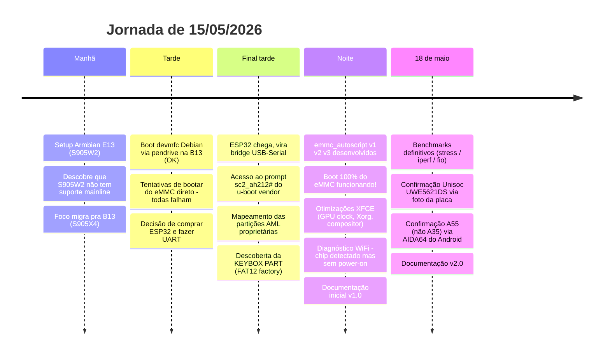
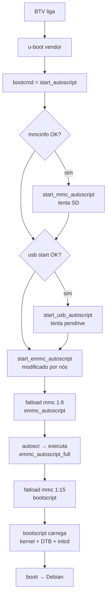
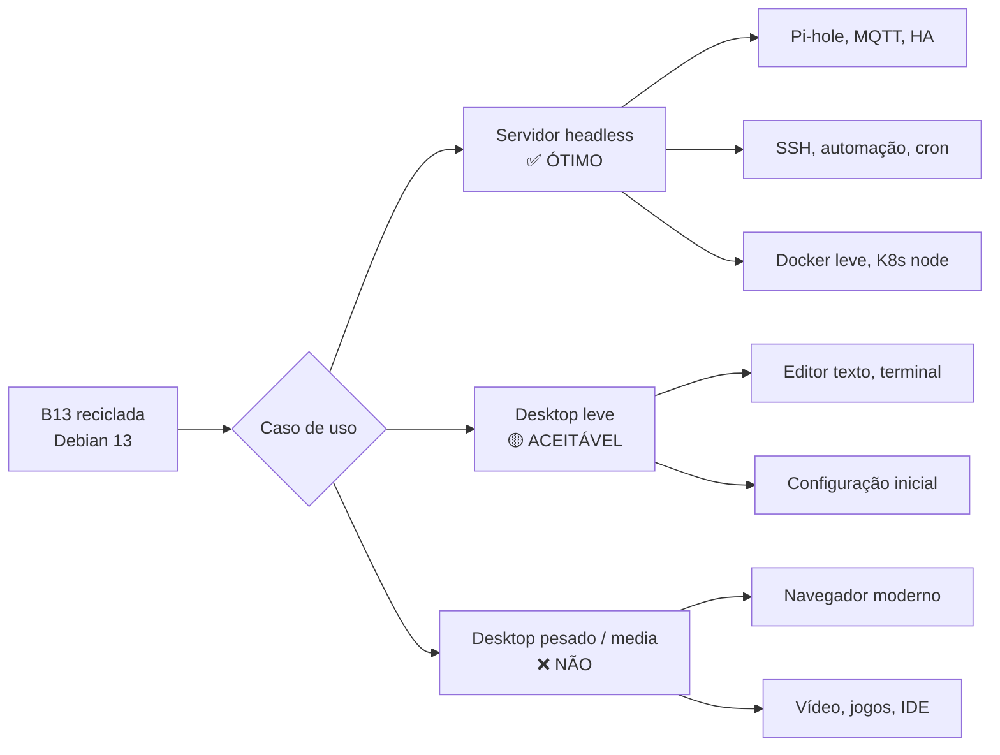

# Diário Técnico — AmlBoot B13

> Engenharia reversa do bootloader vendor de uma TV Box BTV B13 (Amlogic S905X4) pra rodar Debian 13 autônomo do eMMC interno, mais otimizações da stack gráfica, benchmarks de servidor e diagnóstico do chip wifi.
>
> **Autor:** Gabriel Lima
> **Data:** 15 de maio de 2026 (sessão principal) / atualizado em 18 de maio
> **Versão do documento:** 2.0
> **Status final:** Boot autônomo funcionando ✅ • XFCE otimizado ✅ • Servidor ARM viável ✅ • WiFi pendente ❌

---

## Sumário

1. [Resumo executivo](#1-resumo-executivo)
2. [Hardware](#2-hardware)
3. [Linha do tempo](#3-linha-do-tempo)
4. [E13 (S905W2) — dead end](#4-e13-s905w2--dead-end)
5. [B13 (S905X4) — caminho até o boot autônomo](#5-b13-s905x4--caminho-até-o-boot-autônomo)
6. [Otimizações XFCE](#6-otimizações-xfce)
7. [Benchmarks de servidor](#7-benchmarks-de-servidor)
8. [WiFi — diagnóstico até onde foi](#8-wifi--diagnóstico-até-onde-foi)
9. [Spec marketing vs realidade](#9-spec-marketing-vs-realidade)
10. [Android vs Debian — o que se ganha e o que se perde](#10-android-vs-debian--o-que-se-ganha-e-o-que-se-perde)
11. [Casos de uso reais](#11-casos-de-uso-reais)
12. [Backup e recovery](#12-backup-e-recovery)
13. [Pendências e planos](#13-pendências-e-planos)
14. [Lições aprendidas](#14-lições-aprendidas)
15. [Anexos](#15-anexos)

---

## 1. Resumo executivo

Comecei a sessão querendo instalar Armbian numa TV Box BTV E13 (chip S905W2). O suporte mainline do S905W2 (família Meson S4) é experimental — WiFi, IR e som não funcionam mesmo no CoreELEC. Migrei o foco pra uma segunda TV Box, a BTV B13 (chip **Amlogic S905X4**, família SC2, codename interno `ohm`), que tem suporte muito mais maduro.

Na B13, consegui um boot devmfc Debian Trixie via pendrive sem dor. O desafio real era fazer ela bootar **direto do eMMC interno** sem depender de pendrive — coisa que o u-boot vendor proprietário da Amlogic dificulta porque ele tem um layout de partições próprio (AML scheme) que não bate com a tabela MBR criada pelo Linux.

A solução veio em três grandes descobertas:

1. **Acesso ao u-boot vendor via UART** usando um ESP32 como adaptador serial (R$30)
2. **Sequestro da partição KEYBOX (factory partition, mmc 1:6)** que originalmente armazena chaves DRM — gravei um `emmc_autoscript` ali, que é o arquivo que o `start_emmc_autoscript` do u-boot vendor procura
3. **Descoberta de que a partição vendor "super" (mmc 1:15 hex) começa no mesmo setor que a FAT32 /boot criada pela MBR Linux** — isso permite o u-boot ler kernel/DTB direto da nossa partição sem entender MBR

Depois do boot autônomo funcionando, ataquei o XFCE engasgado. A causa real **não era CPU lenta** (Cortex-A55 a ~1.8 GHz dá conta) — era a **GPU Mali-G31 travada em 285 MHz** (3x menos que o máximo de 846 MHz) porque o devfreq governor padrão é tunado pra cargas de jogo, não pra UI. Forcei governor `performance`, ajustei Xorg pra usar DRI3 + PageFlip + glamor explicitamente, e religuei compositor XFWM4 com vsync. Resultado: XFCE fluido com tearing leve residual.

O WiFi (chip Unisoc UWE5621DS SDIO) ficou pendente. Driver out-of-tree existe (CoreELEC `uwe5631-aml`) mas requer porte pra kernel 6.18 e ajustes de DTB. Decisão pragmática: usar dongle USB WiFi (R$20) ou cabo ethernet (100M).

Em 18/05 fiz benchmarks definitivos: **térmica excelente** (pico 51-58°C sob stress 100%), **rede saturando o limite teórico de 100M** (94 Mbps simétrico), **eMMC midrange** (140 MB/s read, 65 MB/s write).

**Conclusão prática:** a B13 reciclada com Debian mainline funciona muito bem como **servidor ARM low-power** (Pi-hole, Home Assistant, MQTT, SSH, automação). Como desktop XFCE é viável só pra tarefas leves; navegador e vídeo saturam a CPU porque a decodificação de vídeo por hardware (V4L2) ainda não está integrada no Mesa.

---

## 2. Hardware

### Modelo principal: BTV B13

Identificação na caixa: "Produto Oficial btv" / "Product Name: OTT BOX" / "Model: B13" / "DC IN: 5V 2A" / "2GB & 16GB".
Identificação na placa: serigrafia `B13_V1.0_20220406` (versão 1.0, fabricada em 06/abr/2022) / lote `QL2247`.
Codename interno do firmware Android/u-boot: **`ohm`**.

| Item | Detalhe |
|---|---|
| Modelo | BTV B13 (Product Name "OTT BOX") |
| SoC | **Amlogic S905X4** (família SC2, Meson SC2, codename `ohm`) |
| CPU | 4× **ARM Cortex-A55** (rev r2p0) @ até **2.0 GHz** (faixa 100-2004 MHz no Android com schedutil; no Debian fica fixo em ~1.8 GHz porque o DTB mainline não tem `operating-points-v2`) |
| ISA | 64-bit ARMv8-A, suporta AES, ASIMD/NEON, PMULL, SHA1, SHA2 |
| GPU | Mali-G31 MP2 (Bifrost), até 846 MHz |
| RAM | 2 GB DDR4 (chip Rayson RS512M32LM4 = 512Mx32 = 16 Gb) |
| Storage | 16 GB eMMC **Samsung KLMAG1JETD-B041** (chip físico Samsung; o controlador reporta-se como "Biwin" via mmc CID — provavelmente Biwin remarca/integra Samsung) |
| Ethernet | **100 Mbps** via PHY interno do SoC (kernel reporta "Meson G12A Internal PHY"), magnetic externo TF1102 (NetSol). **Sem PHY gigabit externo** — hardware 100M only, mesmo que listings online digam o contrário |
| WiFi/BT | **Unisoc UWE5621DS** — chip combo WiFi 2.4/5GHz IEEE 802.11 a/b/g/n/ac + Bluetooth 5.1, conexão SDIO (NÃO é MediaTek MT7668 como diagnosticado inicialmente) |
| HDMI | HDMI 2.0a, suporta 4K@60Hz, HDCP 2.3 |
| Áudio | HDMI out + S/PDIF óptico + jack 3.5mm (AV 3-em-1) |
| USB | 1× USB 3.0 + 1× USB 2.0 (marcada "OTG" na serigrafia, mas funciona como host normal pra pendrive) |
| Slot SD | 1× microSD (TF) na lateral |
| Controle remoto | **Bluetooth** ("Controle remoto com comando de voz" listado na caixa) — não é IR, não precisa apontar |
| Recovery | 2 furos embaixo da carcaça com texto **`RESET`** e **`UPDATE`** em alto relevo no plástico, ~2mm diâmetro × 1.5cm profundidade. Pra nosso procedimento usa o **UPDATE** |
| UART de fábrica | **4 pads expostos na placa**: GND, TX, RX, 3V3 (em coluna, lado dos USBs) |
| EMI shield | Cobertura metálica grande sobre SoC + RAM no verso da placa. Por sorte serve como dissipador passivo |

**Capabilities detectadas pelo AIDA64 no Android original:** `audio.output`, `bluetooth`, `bluetooth_le`, `camera.any`, `camera.external`, `consumerir` (sensor IR físico existe na placa, embora o controle remoto da B13 use BT), `ethernet`, `gamepad`, `hdmi.cec`, `location`, `location.network`, `opengles.aep`, `ram.normal`.

### Modelo secundário: BTV E13

| Item | Detalhe |
|---|---|
| Modelo | BTV E13 V1.0 (data: 2022.06.02) |
| SoC | **Amlogic S905W2** (família Meson S4) |
| CPU | 4× Cortex-A35 (S905W2 é A35 mesmo, não A55) |
| GPU | Mali-G31 |
| RAM | 2 GB |
| WiFi | Provavelmente Unisoc também (mesma família Spreadtrum/Unisoc — sem foto da placa pra confirmar exato modelo) |
| Controle remoto | **Infravermelho** — precisa apontar pra TV box, sensor IR físico na frente |
| Recovery | Mesma mecânica da B13: 2 furos embaixo com RESET e UPDATE em alto relevo. Usa o UPDATE |
| USB | **Múltiplas portas USB 2.0** (todas 2.0). **Boot por pendrive funciona apenas na porta marcada `OTG`** na placa (a primeira, não a do lado do slot SD) |

O S905W2 (Meson S4) ainda não tem suporte sólido no kernel mainline em 2026. A imagem Armbian community "Aml-s9xx-box" não tem DTB nem u-boot pra esse chip — falhou em todos os testes de boot. Apenas o CoreELEC funcionou (DTB `s4_s905w2_2g.dtb` renomeado pra `dtb.img`), mas sem WiFi nem IR.

### ESP32 (adaptador UART)

| Item | Detalhe |
|---|---|
| Modelo | Qualquer ESP32 dev board com UART2 acessível (GPIO16/17) |
| Custo | ~R$30 no Mercado Livre / AliExpress |
| Função | USB-Serial bridge entre PC e UART da BTV |
| Vantagem | 3.3V logic levels idênticos à BTV — conexão direta sem level shifter |

---

## 3. Linha do tempo



---

## 4. E13 (S905W2) — dead end

### Tentativas

Comecei tentando rodar Armbian community (`Armbian_community_26.2.0-trunk.858_Aml-s9xx-box_trixie_current_6.18.26_minimal.img.xz`) via pendrive com toothpick (botão UPDATE embaixo, mesma mecânica da B13). Não bootou.

Detalhe importante da E13: ela tem **mais de uma porta USB, todas 2.0**, e o boot por pendrive só funciona em **uma específica — a marcada `OTG`** na placa (é a primeira, não a do lado do slot de cartão SD). Nas outras USBs o pendrive não é reconhecido como mídia bootável. SD card como boot não cheguei a testar.

Funcionou só com CoreELEC (`CoreELEC-Amlogic-ne.aarch64-21.3-Omega-Generic.img.gz`), usando o DTB `s4_s905w2_2g.dtb` renomeado pra `dtb.img` na raiz do pendrive — e ainda assim só na USB OTG. Também consegui bootar Debian via pendrive com `box=s905w2_generic`, mas:

- **WiFi não funciona** (chip Unisoc sem driver mainline)
- **IR receiver não funciona** (precisa DTB específico) — relevante porque o **controle remoto da E13 é infravermelho**, então sem IR não tem controle
- **Áudio HDMI não testei** (não foi prioridade — segundo relatos da comunidade Armbian, a maioria das boxes S905W2 também não tem áudio funcional, mas não confirmei na minha)

### Por que falhou

O **S905W2** é da família Meson S4. Diferente do S905W "normal" (família GXL/G12 antiga), o S4 é um chip relativamente novo (2022+) e o suporte no kernel mainline ainda é experimental:

- Sem u-boot mainline funcional pra S4
- DTBs específicos não existem na linha principal do kernel
- Drivers proprietários da Amlogic + Unisoc não estão empacotados

Estado final do E13:

✅ Boot via pendrive funciona (porta USB OTG apenas)
✅ SSH via ethernet OK
❌ WiFi
❌ IR (e portanto controle remoto não funciona)
⚠️ Áudio HDMI não testado
⚠️ SD card como boot não testado
⚠️ Suporte experimental, qualquer kernel mais novo pode quebrar

**Decisão:** parar com o E13 por enquanto e focar na B13.

---

## 5. B13 (S905X4) — caminho até o boot autônomo

O S905X4 (família SC2, codename `ohm`) é dramaticamente melhor suportado. Boot pelo pendrive devmfc funcionou de primeira com `box=s905x4_generic`.

Diferente da E13, na B13 o pendrive funcionou em **qualquer porta USB** — testei tanto na USB 2.0 quanto na 3.0. O procedimento todo foi feito com pendrive na USB 3.0 sem problema. SD card como boot não testei. Mesmo botão **UPDATE** embaixo da carcaça pra acionar.

### 5.1 O problema do boot do eMMC

O u-boot vendor proprietário da Amlogic não consegue bootar Linux do eMMC porque:

1. **Layout de partições AML é proprietário** — não usa MBR/GPT padrão
2. **`fatload mmc 1` retorna "Unrecognized filesystem type"** — não enxerga partições nossas
3. **Tabela é "via DTS"** — definida em device tree dentro do firmware vendor, hardcoded

### 5.2 ESP32 como adaptador UART

A B13 tem **4 pads UART expostos na placa** (NÃO 5): `GND`, `TX`, `RX`, `3V3`, em coluna do lado das portas USB. Vieram só com furos pra solda — tive que soldar pinos macho pra conectar jumpers.

O ESP32 vira bridge USB-Serial:

```
ESP32 GND     ─── BTV GND
ESP32 GPIO16  ─── BTV TX    (UART2 RX do ESP32 escuta a BTV)
ESP32 GPIO17  ─── BTV RX    (UART2 TX do ESP32 envia pra BTV)
```

3.3V logic em ambos os lados — conexão direta, sem level shifter.

Baud: 115200 8N1.

Sketch básico:

```cpp
void setup() {
    Serial.begin(115200);
    Serial2.begin(115200, SERIAL_8N1, 16, 17);
}
void loop() {
    while (Serial2.available()) Serial.write(Serial2.read());
    while (Serial.available()) Serial2.write(Serial.read());
}
```

Sketch "v2" com auto-intercept disponível em `scripts/esp32-uart-bridge.ino` — detecta "Hit any key to stop autoboot" e manda Enter sozinho (a janela é muito curta pra digitar manualmente).

### 5.3 Acesso ao prompt vendor

Com ESP32 conectado e Serial Monitor a 115200 baud, ao ligar a BTV aparece:

```
sc2_ah212#
```

A B13 reporta-se internamente como `sc2_ah212` (referência ao SOM development board da Amlogic).

### 5.4 Mapeamento das partições vendor

Com `mmc part` no prompt vendor:

```
Partition Map for MMC device 1
Part   Start   Sectors   Size  Name
00         0      8192   4MB   bootloader
01     73728    131072  64MB   reserved
02    221184   1638400 800MB   cache
03   1875968     16384   8MB   env
04   1908736     65536  32MB   recovery
05   1990656      4096   2MB   frp
06   2011136     16384   8MB   factory       ← KEYBOX PART (FAT12)
07   2043904     49152  24MB   vendor_boot
08   2109440     65536  32MB   tee
09   2191360     16384   8MB   (bmeta)
20   2744320      4096   2MB   vbmeta_system
21   2764800   3276800 1.6GB   super         ← contém /boot FAT32 do Linux
22   6057984  24727552  12GB   userdata      ← contém rootfs ext4 do Linux
```

**Observação crítica**: as partições 21 e 22 começam em setores **idênticos** ao que o `sfdisk` cria pra um MBR Linux com `start=2764800` e `start=6057984`. Isso significa que o u-boot vendor consegue ler nossa FAT32 e ext4 sem entender MBR — basta apontar pra `mmc 1:15` (hex, = 21 decimal = super) e ele lê a FAT32 que criamos.

### 5.5 Estrutura do env do u-boot vendor

```
bootcmd = run start_autoscript; run storeboot

start_autoscript =
    if mmcinfo; then run start_mmc_autoscript; fi;
    if usb start; then run start_usb_autoscript; fi;
    run start_emmc_autoscript                ← este SEMPRE roda no final

start_mmc_autoscript = fatload mmc 0 1020000 s905_autoscript
start_usb_autoscript = fatload usb ${usbdev} 1020000 s905_autoscript
start_emmc_autoscript = if fatload mmc 1 1020000 emmc_autoscript;     ← default genérico
                        then autoscr 1020000; fi;
```

**O default do `start_emmc_autoscript` é genérico (`mmc 1`, sem partição), que falha com "Unrecognized filesystem type"**. Por isso o boot do eMMC nunca funcionava sozinho.

### 5.6 A descoberta da KEYBOX PART

Durante a investigação via UART, encontrei a mensagem repetida nos logs:
```
Filesystem: FAT12 "KEYBOX PART"
```

Investigando, descobri que **a partição vendor "factory" (mmc 1:6)** é uma FAT12 com label "KEYBOX PART", criada com `mkfs.fat`. Originalmente serve pra armazenar chaves DRM do Android. Mas pra nosso uso: é uma FAT12 escondida, escrível via Linux, **e o u-boot vendor a reconhece nativamente**.

Confirmação no UART:
```
sc2_ah212# fatls mmc 1:6
(diretório listável — partição é montável!)

sc2_ah212# fatload mmc 1:6 1020000 emmc_autoscript
** Unable to read file emmc_autoscript **    ← arquivo não existe, mas FAT é lida
```

A partição "factory" é **8MB de FAT12 vazia** acessível tanto via Linux quanto pelo u-boot vendor. Caminho perfeito pra colocar nosso script.

### 5.7 Modificando start_emmc_autoscript

Comando no prompt do u-boot:
```
setenv start_emmc_autoscript 'if fatload mmc 1:6 1020000 emmc_autoscript; then autoscr 1020000; fi;'
saveenv
```

O `saveenv` grava na partição 03 (`env`, 8MB @ setor 1875968). Persistente entre reboots.

### 5.8 Conteúdo do emmc_autoscript

Versão final (v3) — boota do eMMC com fallback USB:

```sh
echo "=== Custom emmc_autoscript v3: Boot 100% eMMC ==="
setenv devtype mmc
setenv devnum 1
setenv distro_bootpart 15
setenv cmd_read "fatload mmc 1:15"

if fatload mmc 1:15 ${loadaddr} bootscript; then
    echo "bootscript carregado do eMMC (mmc 1:15)!"
    autoscr ${loadaddr}
else
    echo "FALHA ao carregar bootscript do eMMC, tentando USB..."
    usb stop
    if usb start; then
        for usbdev in 0 1 2 3; do
            if fatload usb ${usbdev} ${loadaddr} bootscript; then
                echo "bootscript encontrado em usb ${usbdev} (fallback)!"
                setenv devtype usb
                setenv devnum ${usbdev}
                setenv distro_bootpart 1
                setenv cmd_read "fatload usb ${usbdev}:1"
                autoscr ${loadaddr}
            fi
        done
    fi
    echo "Nenhum boot encontrado"
fi
```

Compila com `mkimage -C none -A arm -T script -d emmc_autoscript_full.src emmc_autoscript_full` (gera ~900 bytes com header).

### 5.9 Gravando na factory partition

Do Debian rodando no eMMC (ou no pendrive):
```bash
mkdir -p /mnt/factory
mount -t vfat -o loop,offset=1029701632,sizelimit=8388608 /dev/mmcblk1 /mnt/factory
cp emmc_autoscript_full /mnt/factory/emmc_autoscript
sync
umount /mnt/factory
```

Os números mágicos:
- `1029701632` = byte offset da partição factory (sector 2011136 × 512)
- `8388608` = 8 MB

### 5.10 Fluxo completo do boot autônomo



### 5.11 Resultado final

```
$ uname -a
Linux tvbox 6.18.28-meson64 #1 SMP PREEMPT aarch64 GNU/Linux

$ uptime
up 0 min                Boot time: 4 s

$ df /
/dev/mmcblk1p2          14G   35% used

$ lsblk | grep -v sda
mmcblk1       179:0    0 14.7G  0 disk
├─mmcblk1p1   179:1    0  512M  0 part /boot
└─mmcblk1p2   179:2    0 12.9G  0 part /
mmcblk1boot0  179:32   0    4M  1 disk
mmcblk1boot1  179:64   0    4M  1 disk
```

Boot em **4 segundos**, Debian 13 + XFCE rodando 100% do eMMC interno. Sem pendrive, sem toothpick, sem ESP32 — só ligar na tomada.

### 5.12 Sobre a opção `gigabit` que NÃO funcionou

Tentei configurar `box=s905x4_generic_gigabit` em vez de `s905x4_generic` — pendrive ficou em loop, não bootou. Investigando depois, comparei os 2 DTBs que cada perfil carrega:

| Arquivo | `phy-mode` | PHY usado | Velocidade |
|---|---|---|---|
| `meson-sc2-ah212-generic.dtb` | **RMII** | Interno do SoC (endereço 0x08, max-speed 100) | **100 Mbps** |
| `meson-sc2-ah212-generic-gbit.dtb` | **RGMII-TXID** | Externo (endereço 0x00, max-speed 1000) | **1000 Mbps** |

O perfil `_gigabit` espera um **chip PHY gigabit externo** (tipo RTL8211F) conectado ao SoC via RGMII (interface de muitos pinos com delay 1400ps). Olhando a foto da placa B13, próximo ao RJ45 só há o **TF1102** (NetSol — transformador magnético, não PHY) — nenhum chip PHY gigabit dedicado. A B13 usa o **PHY interno do SoC S905X4**, que é apenas RMII/100Mbps por design da Amlogic.

**Conclusão: a B13 é 100 Mbps por hardware, sem solução software possível.** A caixa BTV não menciona "gigabit" — só diz "RJ45 LAN Port×1" sem velocidade.

---

## 6. Otimizações XFCE

### 6.1 O problema

Depois do boot funcional, abrir o XFCE foi decepcionante: mouse travado, janelas engasgadas, menus animavam com lag visível. Hipóteses iniciais:

❌ CPU lenta — não era (4× Cortex-A55 @ 1.8GHz, sysbench mostrou 982 events/s, alto)
❌ Falta de driver GPU — não era (Mali-G31 + Panfrost funcionando, glmark2 score 412)
❌ Falta de RAM/swap — não era (sempre <500MB usados de 1.9GB)
❌ Software rendering — não era (Xorg.log: `glamor X acceleration enabled on Mali-G31 (Panfrost)`)

### 6.2 A descoberta: GPU travada em 285 MHz

```bash
$ cat /sys/class/devfreq/fe400000.gpu/cur_freq
285714281
$ cat /sys/class/devfreq/fe400000.gpu/available_frequencies
285714281 400000000 500000000 666666666 846000000
```

A Mali-G31 estava na frequência **mínima** (285 MHz, 1/3 do máximo 846 MHz). O governor padrão era `simple_ondemand` — tunado pra cargas sustentadas de jogos, não pra burst de UI (mover janela = 100ms de carga, abaixo do threshold de rampup).

### 6.3 Solução GPU

Trocar pra `performance`:
```bash
echo performance > /sys/class/devfreq/fe400000.gpu/governor
```

Imediato: glxgears subiu, mouse melhorou drasticamente, sensação geral de fluidez voltou.

Persistência via systemd (`/etc/systemd/system/gpu-performance.service`) — ver scripts em anexo.

Trade-off: GPU em max o tempo todo consome ~0.5-1W a mais. Numa TV box ligada na tomada, irrelevante. Temperatura passou de 42°C idle pra ~45°C — longe de throttle.

### 6.4 Ajustes no Xorg

O `glamor` tava ativo mas o Xorg.log mostrava `[DRI2] Setup complete` antes do DRI3 — suspeita de fallback. Forcei DRI3 + PageFlip explicitamente em `/etc/X11/xorg.conf.d/20-meson.conf` (anexo). Melhora foi marginal (1506 → 1449 FPS no glxgears — ruído estatístico), mas garante o estado certo.

### 6.5 Compositor XFWM4

Compositor desligado: ghosting ao mover janelas (sem double-buffer). Compositor ligado sem vsync: tearing. A combinação certa:

```bash
xfconf-query -c xfwm4 -p /general/use_compositing -s true
xfconf-query -c xfwm4 -p /general/sync_to_vblank -n -t bool -s true
xfconf-query -c xfwm4 -p /general/unredirect_overlays -s true
```

Detalhe: a propriedade `sync_to_vblank` pode não existir por padrão — precisa de `-n -t bool` pra criar.

### 6.6 Tentativas que NÃO funcionaram

- **TearFree no modesetting**: piorou a fluidez. Esse hardware não roda bem com TearFree.
- **AccelMethod "none" + ShadowFB**: pior em tudo.
- **picom como compositor**: piorou — duplo round-trip GLX→Panfrost→meson-drm.
- **LXQt**: mesmo lag do XFCE — confirma que não é DE, é a stack Xorg.
- **Sway (Wayland)**: instalado mas não testado completo (lightdm não detectou sessão Wayland automaticamente — projeto pra outro dia).

### 6.7 O caso do mouse 8K HS

Numa virada inesperada: tinha um mouse gamer "LXDDZ 2.4G 8K HS Receiver" plugado. **Polling rate 8000 Hz** + 4 endpoints HID (Mouse, System Control, Consumer Control, Keyboard). Resultado: Xorg saturado em 36.9% de CPU **só processando eventos do mouse**. Lição: mouses gamer 8000 Hz não combinam com ARM modesto.

Mesmo limitando o mouse a 500 Hz via firmware no PC, ainda incomodava (4 endpoints HID continuam). Solução: usar mouse comum (Compx 2.4G 125 Hz) e ponto.

### 6.8 Estado final XFCE

| Métrica | Antes | Depois |
|---|---|---|
| GPU freq | 285 MHz | 846 MHz (3x) |
| Xorg idle CPU | ~15% (com mouse 8K: 36%) | 6-10% |
| Renderer | Mali-G31 (Panfrost) com fallback DRI2 | Mali-G31 (Panfrost) DRI3 + PageFlip |
| Compositor | off (com ghost) | on + vsync (sem ghost, tearing leve) |
| Sensação | Engasgado | Fluido com tearing leve residual |

**Limite atingido.** O tearing leve restante é o limite real da stack Mali-G31 + meson-drm + glamor + Xorg em kernel mainline. Pra eliminar 100% precisaria patchear DTB, recompilar Mesa, ou migrar pra Wayland — trabalho de dias.

### 6.9 Truque do EMI shield (achado em 18/05)

Durante o benchmark térmico, descobri que o EMI shield (a chapa metálica grande sobre o SoC visível no verso da placa) tinha **folga sobre o chip Amlogic**. Apertando manualmente o shield contra o SoC, a temperatura sob stress caiu de **58°C pra 51°C** — ~7°C de melhoria com zero custo.

Esse gap é comum em TV box pirata: o shield é projetado primariamente pra blindagem eletromagnética (compliance FCC/CE), não pra dissipação. A fábrica não coloca thermal pad porque encarece.

**Upgrade recomendado pra uso 24/7:** thermal pad fino (1-1.5mm, R$15-25) entre o SoC e o shield. Esperado: estabilizar em ~45-50°C mesmo sob stress 100%. Vai melhorar a vida útil do eMMC e do SoC.

---

## 7. Benchmarks de servidor

Testes feitos em 18/05/2026 pra caracterizar a B13 como servidor headless.

### 7.1 Térmica sob stress sustentado

```bash
# Janela A: monitora temp
watch -n 1 "cat /sys/class/thermal/thermal_zone*/temp"

# Janela B: carga 100% em 4 cores por 5 minutos
stress-ng --cpu 4 --cpu-method matrixprod --timeout 5m --metrics-brief
```

| Estado | thermal_zone0 | thermal_zone1 |
|---|---|---|
| Idle | 40.7°C | 41.4°C |
| Após 3min stress (shield com folga) | 55.2°C | 54.9°C |
| Pico em 5min stress (shield com folga) | **58°C** | - |
| Pico em 5min stress (shield apertado) | **51°C** | - |

**Conclusão:** sem throttling em nenhum cenário. A B13 aguenta carga sustentada 100% 4 cores por horas sem problema. Apta a operação 24/7.

### 7.2 Throughput de rede (iperf3)

PC servidor (Wi-Fi 192.168.3.101) ↔ B13 cliente (Ethernet 192.168.3.117).

| Direção | Throughput | Retransmissões | Veredito |
|---|---|---|---|
| Download (PC → B13) | **93.4 Mbps** | 1 em 30s | ✅ no limite teórico |
| Upload (B13 → PC) | **94.1 Mbps** | 0 em 30s | ✅ no limite teórico |

Sustentado, estável, simétrico. **A B13 entrega 100% do que o hardware Ethernet 100M consegue dar.** Não há otimização possível por software.

### 7.3 Velocidade do eMMC (fio com `--direct=1`)

| Teste | Resultado | Veredito |
|---|---|---|
| Read sequencial 4M | **140 MB/s** | ⚠️ Abaixo de HS200 ideal, normal pra eMMC econômico |
| Random read 4k | **16 MB/s, 3940 IOPS** | ✅ Dentro do esperado |
| Write sequencial 4M | **65 MB/s** | ⚠️ Lentinho, latência ocasional de 670ms (garbage collection) |
| Random write 4k | **19 MB/s, 4726 IOPS** | ✅ Bom pra logs/SQLite |

**Conclusão:** eMMC midrange/econômico. Bom o suficiente pra Pi-hole / Home Assistant / MQTT / banco SQLite. Lento pra copiar arquivos grandes ou rodar Docker pull pesado.

Atenção: rodar fio em `/tmp` (que é tmpfs/RAM) dá números absurdos (1+ GB/s) porque testa RAM, não disco. Tem que usar `/root` ou outro path no eMMC + flag `--direct=1` pra pular page cache.

### 7.4 Memory bandwidth (sysbench)

```
3811 MB/s, 10240 ops em 2.68s, single-thread
```

DDR4 ~3.8 GB/s — bate com expectativa pra ARM SBC midrange.

### 7.5 Tempo de boot

```
$ systemd-analyze
Startup finished in 890ms (kernel) + 3.987s (userspace) = 4.877s
graphical.target reached after 3.926s in userspace.
```

**5 segundos do power-on ao login screen.** Mais rápido que muitos x86 desktop.

---

## 8. WiFi — diagnóstico até onde foi

### 8.1 Chip identificado

A foto da placa mostra claramente um chip etiquetado **Unisoc UWE5621DS** (etiqueta verde, posição central-direita). Inicialmente foi confundido com MediaTek MT7668 porque o devmfc empacota o driver `wlan_mt76x8_sdio.ko` por padrão (que serve pra outras TV boxes BTV), mas o **chip físico é Unisoc**.

Specs do chip UWE5621DS:
- WLAN IEEE 802.11 a/b/g/n/ac 2×2 MU-MIMO
- 20/40/80 MHz VHT
- 2.4 GHz + 5 GHz
- Bluetooth 5.1 Smart Ready
- Conexão SDIO 3.0
- Antena externa via fio + IPEX (visível na foto da placa)

### 8.2 Estado atual no Debian

```
$ ls /sys/bus/sdio/devices/
mmc2:8800:1
$ cat /sys/bus/sdio/devices/mmc2:8800:1/vendor
0x0000
$ cat /sys/bus/sdio/devices/mmc2:8800:1/device
0x0000
```

O cartão SDIO foi enumerado pelo kernel (`mmc2: new UHS-I speed SDR104 SDIO card at address 8800`) mas com IDs **zerados** — o chip não respondeu ao probe de identificação. Hipótese: o DTB genérico AH212 não tem os GPIOs/clocks/regulators específicos do BTV B13 pra dar power-on completo no chip Unisoc, e ele fica em estado parcial.

### 8.3 Driver no Linux

- **Mainline:** não existe driver Unisoc UWE5621DS no kernel mainline (verificado kernel 6.18)
- **Out-of-tree disponíveis:**
  - [CoreELEC/uwe5631-aml](https://github.com/CoreELEC/uwe5631-aml) — driver oficial do CoreELEC pra Amlogic
  - [simonchen007/uwe5621-aml](https://github.com/simonchen007/uwe5621-aml) — fork simplificado
  - [KryptonLee/uwe5621ds-aml](https://github.com/KryptonLee/uwe5621ds-aml) — kernel 4.9 (antigo)

O `wlan_mt76x8_sdio.ko` que o devmfc empacotou é da MediaTek (vendor 037A) — driver errado pro nosso chip. Carrega sem erro mas não vincula porque o ID SDIO esperado (`v037Ad7608`) não bate com o nosso device (que aparece zerado).

### 8.4 Caminhos pra resolver (não tentados)

1. **DTB do CoreELEC pro BTV B13** específico, usado como overlay — caminho mais limpo
2. **Compilar `uwe5631-aml`** do CoreELEC e portar pra kernel 6.18 mainline — trabalhoso (~214 arquivos), chance 30-50% de funcionar
3. **Habilitar debugfs no kernel cmdline** (`debugfs=on`) pra inspecionar clocks/GPIOs/regulators e tentar pulsar manualmente — tiro no escuro
4. **Dongle USB WiFi** — solução pragmática, ~R$15-30, plug & play com drivers mainline

### 8.5 Decisão

**Dongle USB WiFi** quando precisar mobilidade. Por enquanto cabo ethernet funciona perfeitamente (e a B13 é geralmente usada como servidor estático, ethernet faz mais sentido).

### 8.6 Bluetooth

Mesmo chip Unisoc UWE5621DS faz BT 5.1. Mesma situação do WiFi: driver mainline ausente, driver out-of-tree complicado. **Não funciona no Debian atual.**

Relevante: o **controle remoto da B13 é Bluetooth** (não IR como na E13). Então pra usar o controle remoto da TV box no Debian, precisaria do BT funcionando primeiro. Sem isso, o controle remoto fica inerte.

---

## 9. Spec marketing vs realidade

Comparação útil pra quem quer reciclar uma B13 sem expectativas erradas:

| Spec da caixa BTV | Realidade observada |
|---|---|
| ARM Cortex-A55 | ✅ Cortex-A55 confirmado |
| Mali-G31 MP2 | ✅ Mali-G31 MP2 |
| 2GB RAM | ✅ 2GB DDR4 (chip Rayson) |
| 16GB armazenamento | ✅ 16GB eMMC Samsung KLMAG1JETD |
| WiFi 2.4G & 5G +200 Mbps | ⚠️ Unisoc UWE5621DS — sem driver mainline no Debian |
| Bluetooth 5.0 | ⚠️ Mesmo chip, mesma situação. Caixa diz 5.0; chip oficialmente é 5.1 |
| RJ45 LAN | ⚠️ **100 Mbps somente** (caixa não mente, mas listings online frequentemente sim) |
| HDMI 2.0 / 4K@60fps | ✅ Confirmado pelo kernel |
| Optical S/PDIF | ✅ Confirmado (não testado mas porta existe) |
| Android 11 | ↩️ Substituído por Debian 13 |
| Controle remoto com comando de voz | ✅ via Bluetooth — não funciona no Debian (BT inoperante) |

---

## 10. Android vs Debian — o que se ganha e o que se perde

A pergunta natural ao reciclar: "no Android funciona tudo e roda 4K, no Debian engasga até no YouTube. Por quê?" A resposta: **mesmo hardware, stacks de software completamente diferentes**.

| Aspecto | Android (vendor BTV) | Debian (nosso setup) |
|---|---|---|
| Kernel | 5.4.180 Amlogic BSP (vendor) | 6.18.28 mainline (Linux comunidade) |
| DTB | `sc2_ohm.dtb` específico do B13 | `meson-sc2-ah212.dtb` placa de referência genérica |
| Driver GPU | Mali r25p1 proprietário (OpenGL ES 3.2 + Vulkan) | Panfrost mainline (OpenGL ES 3.1) |
| Decode vídeo | V4L2 vendor + Mali userspace = 4K hardware AV1/H265/H264 | `meson-vdec` mainline existe mas não integrado ao Mesa/Firefox = software CPU |
| DVFS CPU | schedutil 100-2004 MHz | Travada em ~1.8 GHz (DTB sem `operating-points-v2`) |
| DVFS GPU | Dinâmico vendor | Tivemos que forçar `performance` |
| WiFi (UWE5621DS) | Driver vendor Unisoc + DTB com power-on correto | Driver ausente, chip não acorda |
| BT (UWE5621DS) | Stack vendor + hciattach + firmware | Mesma situação do WiFi |
| Áudio HDMI | Funciona (testado no Android) | Não funciona (`meson-aiu` mainline parcial) |
| HDMI CEC | Stack vendor pronta | `cec-client` existe mas não testado |
| IR (sensor físico existe) | Capability `consumerir` confirmada | Não mapeado no DTB |
| Ethernet | 100M | ✅ 100M (sem perda) |

**Tradução prática:** o Android é uma stack monolítica fechada onde Amlogic + BTV passaram anos integrando driver-by-driver. O "Debian mainline" é a stack LIVRE, sem segredos, mas ainda não foi portada inteira pra esse hardware. Aplicações mainline em TV box geralmente cobrem 60-70% do hardware nos primeiros anos após o SoC sair.

**Mesmo SoC em outras TV boxes (Xiaomi etc) rodando Android oficial certificado pelo Google entrega 4K@60 perfeitamente.** Não é hardware da B13 ser pior — é a stack Android oficial ser melhor otimizada que pirata + Debian mainline genérico. Se a Xiaomi rodasse Debian mainline também, teria os MESMOS problemas que temos aqui (e provavelmente mais, porque Xiaomi tem hardware proprietário tipo voice remote).

---

## 11. Casos de uso reais

Depois de tudo testado, mapa honesto de pra que a B13 reciclada serve bem ou mal:

| Caso de uso | Viabilidade | Por quê |
|---|---|---|
| **SSH bastion / jump host** | ✅ Excelente | Idle ~40°C, 2 GB RAM ociosos, latência baixa |
| **Pi-hole / AdGuard Home** | ✅ Excelente | DNS é leve, ~80 MB RAM, latência ~1ms |
| **Home Assistant** | ✅ Ótimo | A55 dá conta, SQLite roda bem |
| **MQTT broker (Mosquitto)** | ✅ Ótimo | Workload trivial pra esse hardware |
| **Node Exporter / Prometheus agent** | ✅ Ótimo | Métricas são leves |
| **Servidor Docker leve (2-3 containers)** | ✅ Bom | RAM suficiente pra Portainer + 1-2 services pequenos |
| **Wireguard server** | 🟡 Ok | ~30-50 Mbps (CPU é gargalo na crypto) |
| **Servidor de arquivos LAN (SMB/NFS)** | 🟡 Limitado | Rede 100M cap em ~12 MB/s, eMMC write 65 MB/s — funciona pra LAN pequena |
| **NAS pessoal / backup remoto** | 🟡 Aceitável | Limitado pela rede; eMMC write lento |
| **Cluster homelab (K3s node)** | ✅ Excelente | Caso de uso perfeito pra estudar |
| **Aprender Linux/redes/scripts** | ✅ Ideal | Hardware barato, sem medo de quebrar |
| **Servidor de mídia (Jellyfin/Plex)** | ❌ Não | Sem transcoding hardware no Linux mainline |
| **Desktop com navegador moderno** | ❌ Não | Firefox + YouTube = load 10, swap pressionando |
| **Mediabox 4K (Kodi)** | ❌ Não | Sem decode hardware (V4L2 não integrado) |
| **Workstation Linux** | ❌ Não | CPU/RAM insuficientes pra cargas modernas de desktop |

### Hardware vs uso



---

## 12. Backup e recovery

A "rede de segurança" pra reverter se algo der errado durante o processo. **Faça antes de qualquer modificação irreversível.**

### 12.1 Backup do eMMC inteiro (4 GB primeiros bytes)

Cobre bootloader (4MB) + reserved (64MB) + cache + env + recovery + frp + factory + vendor_boot + parte do tee + bmeta.

```bash
dd if=/dev/mmcblk1 bs=1M count=4 of=/root/emmc-first-4mb-backup.img status=progress
md5sum /root/emmc-first-4mb-backup.img
```

Tamanho: 4 MB. Útil pra restaurar bootloader caso seja sobrescrito.

### 12.2 Backup só do u-boot vendor

A partição `bootloader` (mmc 1:0) é os primeiros 4 MB do eMMC.

```bash
dd if=/dev/mmcblk1 bs=512 count=8192 of=/root/u-boot-original-backup.img status=progress
md5sum /root/u-boot-original-backup.img
# Esperado: 4 MB
```

### 12.3 Backup só da env (antes de modificar com saveenv)

A partição `env` (mmc 1:3) começa em setor 1875968 e tem 8 MB (16384 setores).

```bash
dd if=/dev/mmcblk1 bs=512 skip=1875968 count=16384 of=/root/uboot-env-area-backup.img status=progress
md5sum /root/uboot-env-area-backup.img
# Esperado: 8 MB
```

**Esse é o backup mais crítico** pra reverter o `setenv start_emmc_autoscript`. Faça antes do `saveenv` no u-boot.

### 12.4 Backup da factory partition (KEYBOX)

A partição factory (mmc 1:6) tem 8 MB. Originalmente armazena chaves DRM do Android — perde se sobrescrever (pode quebrar Widevine etc).

```bash
dd if=/dev/mmcblk1 bs=512 skip=2011136 count=16384 of=/root/factory-keybox-backup.img status=progress
md5sum /root/factory-keybox-backup.img
```

### 12.5 Restaurar caso algo dê errado

Boota do pendrive devmfc (toothpick + UPDATE), depois:

```bash
# Restaurar u-boot vendor
dd if=u-boot-original-backup.img of=/dev/mmcblk1 bs=512 conv=fsync status=progress

# Restaurar env (volta start_emmc_autoscript ao original)
dd if=uboot-env-area-backup.img of=/dev/mmcblk1 bs=512 seek=1875968 conv=fsync status=progress

# Restaurar factory/KEYBOX (volta DRM keys do Android)
dd if=factory-keybox-backup.img of=/dev/mmcblk1 bs=512 seek=2011136 conv=fsync status=progress

sync
reboot
```

### 12.6 Recurso máximo: reflash via Amlogic USB Burning Tool

Se o eMMC ficar inconsistente a ponto do u-boot não bootar nem pelo modo UPDATE, ainda dá pra reflashear via **Amlogic USB Burning Tool** (Windows) com a imagem original do Android BTV. Procedimento:

1. PC Windows com USB Burning Tool instalado
2. Cabo USB-A macho ↔ USB-A macho (USB OTG) entre PC e B13
3. Image original `.img` da BTV (procurar em fóruns/SAC ou backup completo seu)
4. Liga B13 no modo recovery + plugga USB OTG → ferramenta detecta → flash

Esse é o "reset de fábrica completo" se tudo mais falhar.

---

## 13. Pendências e planos

### 13.1 Versão 2 — pendrive auto-installer (não exige UART)

A grande sacada que descobri perto do final: como o `start_autoscript` do u-boot vendor **sempre** chama `start_emmc_autoscript` no final, o `setenv` + `saveenv` pode ser feito a partir de um script u-boot embutido no pendrive em vez de via UART manual.

Já tenho o **bootscript-amlboot.src** pronto (anexo) — é o bootscript devmfc com 5 linhas adicionadas no topo que fazem o `setenv start_emmc_autoscript` + `saveenv` antes do boot normal do kernel.

O que ainda falta pra Versão 2 ser completa:

- [ ] `first-boot.sh` — script que ao primeiro boot do Debian particiona o eMMC, copia /boot e rootfs do pendrive, grava o emmc_autoscript_full na factory, e reinicia
- [ ] `amlboot-firstboot.service` — systemd unit com `ConditionPathExists=/.first-boot.flag` pra rodar só uma vez
- [ ] `build-pendrive.sh` — script que pega uma imagem devmfc base e injeta os 3 acima, gerando `.img.xz` pronto pra dd

Quando tiver, o procedimento de instalação numa B13 nova será literalmente: "grava pendrive (Balena Etcher serve), plug, toothpick + ligar, espera 5 min, remove pendrive, pronto". Sem UART, sem ESP32, sem comandos.

### 13.2 E13 (S905W2)

Aplicar a mesma metodologia: UART intercept → `printenv` → mapear partições → achar partição-canal equivalente à factory KEYBOX → hijack do `start_emmc_autoscript`. Provavelmente 1-2 horas se a estrutura do u-boot for similar (provável — é o mesmo SoC family Amlogic, só geração diferente).

### 13.3 WiFi B13

Conforme seção 8.4. Caminho mais promissor: extrair DTB do CoreELEC e usar como overlay, depois compilar `uwe5631-aml` adaptado pra kernel 6.18.

### 13.4 Versão 3 — "AmlBoot" universal

Visão de longo prazo: pendrive estilo Ventoy que **detecta o SoC** (S905X4, S905W2, S905X3, S922X...) e aplica a configuração certa automaticamente. Pra reciclar TV boxes piratas brasileiras como mini-PCs educativos.

### 13.5 Outros TODOs menores

- [ ] Aceleração de vídeo V4L2 (`meson-vdec.ko`) — configurar mpv/Kodi pra usar, libera reprodução 4K H.264/H.265 sem encostar na CPU
- [ ] Reduzir/remover swapfile de 2GB (uso ficou em 0, swap em eMMC desgasta flash)
- [ ] DTB próprio com `operating-points-v2` da Mali pra DVFS real (ganha eficiência energética, baixa temperatura)
- [ ] Testar Sway (Wayland) pra ver se desvia do gargalo Xorg+glamor
- [ ] Thermal pad físico sobre o SoC pra melhorar dissipação
- [ ] Testar áudio analógico jack 3.5mm (talvez funcione mesmo com HDMI quebrado)
- [ ] Testar HDMI CEC (cec-client)

---

## 14. Lições aprendidas

### Técnicas

1. **U-boot vendor da Amlogic SEMPRE chama `start_emmc_autoscript` no final do `start_autoscript`** — isso é o gancho universal pra customizar boot sem mexer em bootcmd
2. **A KEYBOX PART (factory partition, mmc 1:6) é FAT12 acessível tanto via Linux quanto u-boot** — caminho perfeito pra scripts de hijack
3. **Layout de partições AML "super" e "userdata" coincide em offset com partições MBR criadas pelo sfdisk** — basta usar os números mágicos certos (2764800 e 6057984)
4. **`mmc 1:15` (hex) no u-boot vendor = partição 21 decimal = "super"** — caminho pra ler /boot FAT32 sem precisar de MBR
5. **ESP32 é um adaptador UART perfeito pra hardware ARM 3.3V** — não precisa de conversor de nível, custa R$30
6. **Mali-G31 + Panfrost roda bem mas o devfreq governor padrão sabota UI** — forçar `performance` é necessário em desktop interativo
7. **Mouses gamer 8K HS são incompatíveis com ARM modesto** — Xorg satura processando interrupts
8. **EMI shield de TV box pirata frequentemente tem folga sobre o SoC** — apertar/colocar thermal pad melhora 5-10°C
9. **fio em `/tmp` mede RAM (tmpfs), não disco** — sempre usar `--direct=1` em path real
10. **Verificar a foto física do chip wifi antes de assumir baseado em driver carregado** — driver pode estar errado, chip é a fonte de verdade

### Estratégicas

1. **Faça backup do Android original primeiro** — flash inicial via Amlogic USB Burning Tool é a única recuperação se algo der ruim
2. **Não use TV box pirata com S905W2 / Meson S4 pra Linux** — escolha S905X4 / S905X3 / S922X com suporte mainline maduro
3. **Cortex-A55 a 2 GHz é mais capaz do que parece** — sysbench mostrou 982 events/s × 4 threads, suficiente pra servidor robusto
4. **Reboot limpo é diferente de "restart lightdm"** — sessões longas de tuning acumulam estado residual; reboot zera tudo
5. **Sessão de 12h causa fadiga visual** — em algum momento "fluido" e "com lag" se confundem; pausa ajuda mais que mais comandos
6. **Marketing de TV box pirata mente em specs** — listings online costumam inventar gigabit em hardware 100M. Foto da placa é a verdade.

### Filosóficas

> **"Reciclar pra educar."**
> Brasil tem milhões de TV boxes piratas instaladas. Quando o IPTV pirata morre (e morre toda hora), elas viram lixo. Com AmlBoot, viram mini-PCs Linux com 2GB RAM, 16GB storage, ethernet, HDMI 4K — custando R$0 pro usuário, e legal (Linux + apps livres). Caso de uso pra ensino de eletrônica e Linux, redução de e-waste, e democratização de computação.

---

## 15. Anexos

Arquivos disponíveis na pasta `scripts/`:

| Arquivo | Descrição |
|---|---|
| `bootscript-amlboot.src` | Bootscript devmfc patched com setenv+saveenv embutido (Versão 2 do auto-installer) |
| `emmc_autoscript_full.src` | Script u-boot do boot autônomo do eMMC (gravado na factory partition) |
| `gpu-performance.service` | systemd unit pra GPU governor performance |
| `20-meson.conf` | Config do Xorg com modesetting+glamor+DRI3+PageFlip |
| `esp32-uart-bridge.ino` | Sketch do ESP32 como adaptador UART USB-Serial |
| `aml_autoscript_debug.src` | **Fóssil:** script de diagnóstico usado na fase de investigação |
| `aml_autoscript_emmc_only.src` | **Fóssil:** tentativa "devmfc multiboot" não usada na solução final |

### Comandos cheat-sheet

```bash
# Bootar BTV B13 do eMMC (autônomo): só ligar na tomada

# Verificar estado do sistema
cat /sys/class/devfreq/fe400000.gpu/governor      # esperado: performance
cat /sys/class/devfreq/fe400000.gpu/cur_freq      # esperado: 846000000
systemctl status gpu-performance.service          # esperado: active (exited)
glxinfo | grep Renderer                           # Mali-G31 (Panfrost)

# Mount factory partition (KEYBOX PART) pra ler/gravar emmc_autoscript
mkdir -p /mnt/factory
mount -t vfat -o loop,offset=1029701632,sizelimit=8388608 /dev/mmcblk1 /mnt/factory
ls /mnt/factory/

# Backups (ver §12 pra detalhes)
dd if=/dev/mmcblk1 bs=512 count=8192 of=/root/uboot-backup.img
dd if=/dev/mmcblk1 bs=512 skip=1875968 count=16384 of=/root/env-backup.img
dd if=/dev/mmcblk1 bs=512 skip=2011136 count=16384 of=/root/factory-backup.img

# Benchmarks rápidos
stress-ng --cpu 4 --cpu-method matrixprod --timeout 1m --metrics-brief
iperf3 -c <IP_SERVIDOR> -t 30
fio --name=test --rw=randread --bs=4k --size=512M --filename=/root/test --runtime=20 --direct=1
```

### Referências

- [devmfc/debian-on-amlogic](https://github.com/devmfc/debian-on-amlogic) — base do pendrive Debian usado
- [ophub/amlogic-s9xxx-armbian](https://github.com/ophub/amlogic-s9xxx-armbian) — alternativa Armbian
- [CoreELEC/uwe5631-aml](https://github.com/CoreELEC/uwe5631-aml) — driver wifi Unisoc pra Amlogic
- [educabox/educabox](https://github.com/educabox/educabox) — tutoriais BR de BTV boxes
- [Armbian Forum — Amlogic Boxes](https://forum.armbian.com/forum/127-amlogic-meson/) — discussões técnicas

---

*Fim do diário v2.0.*
