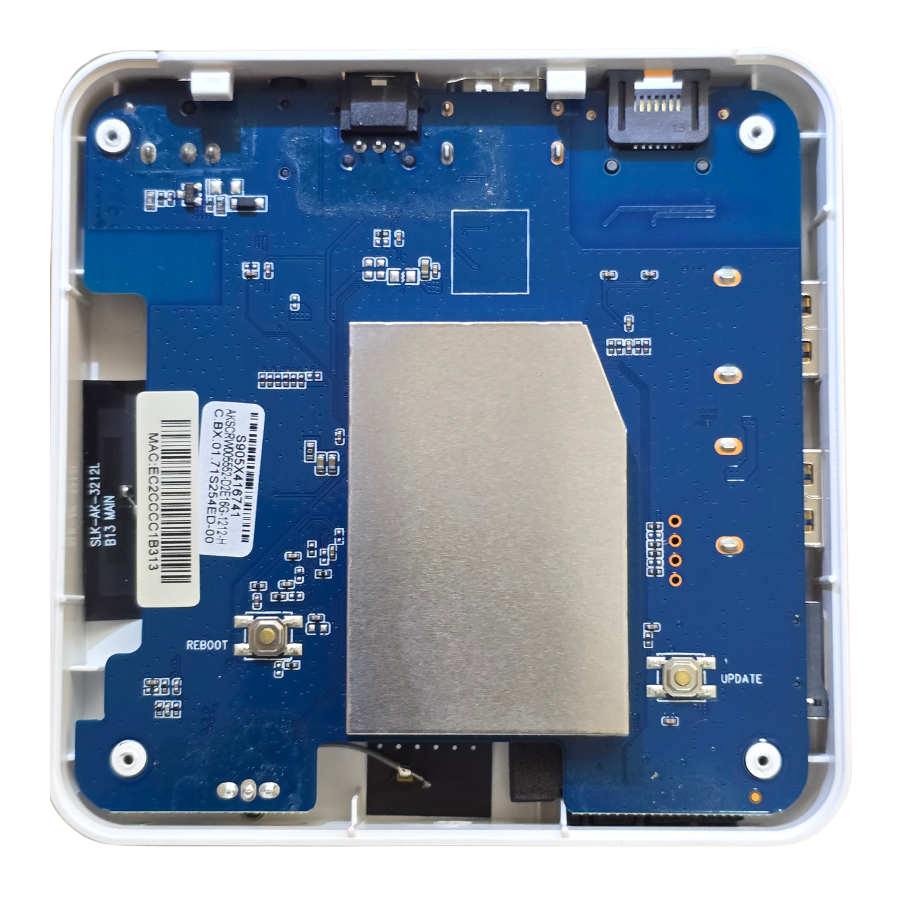
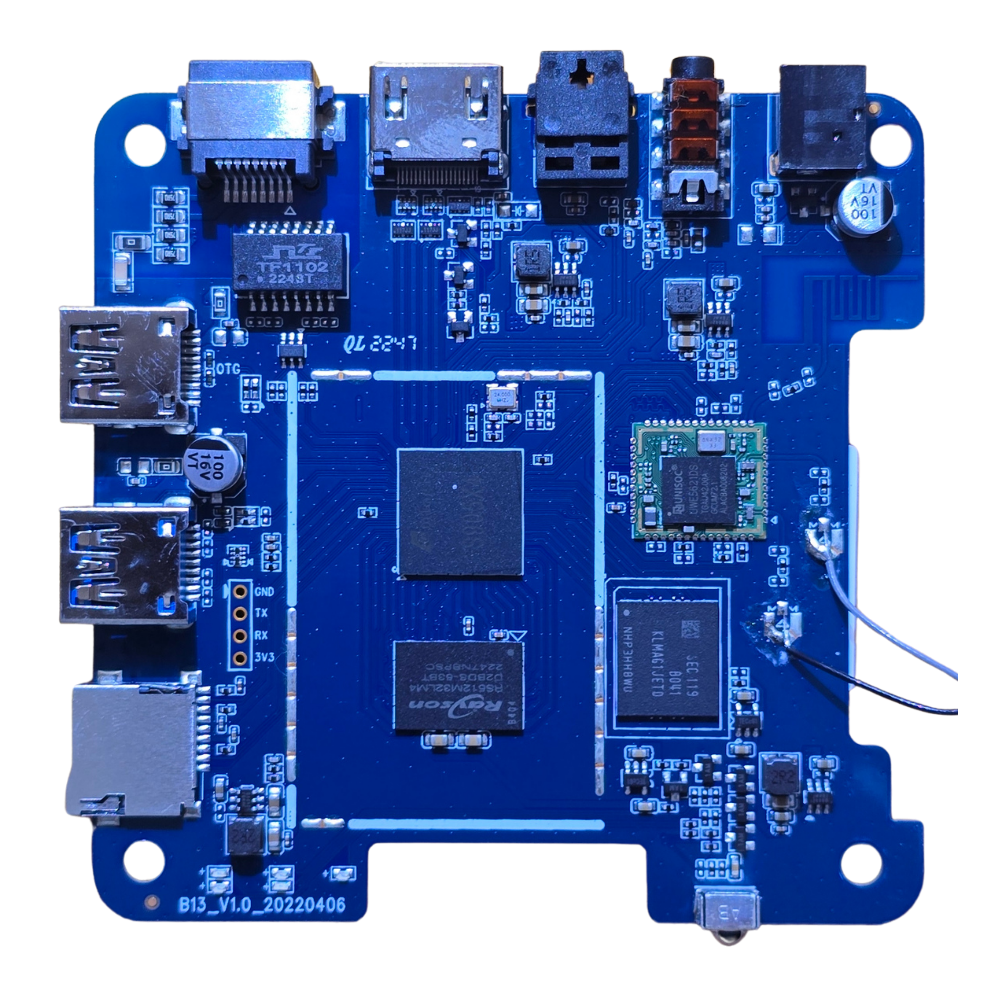
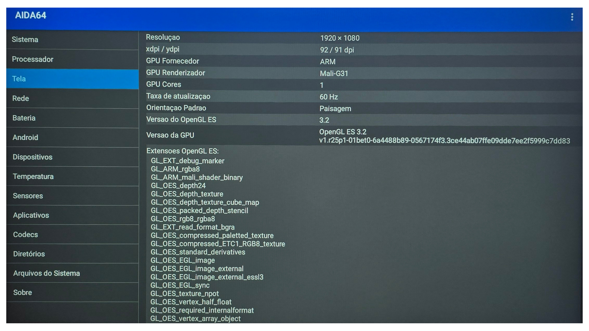
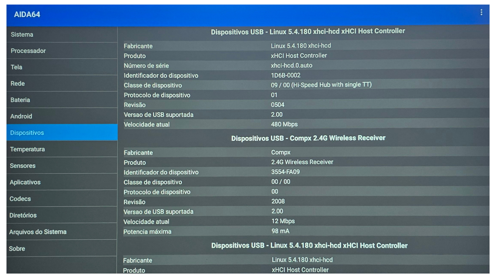

  

# AmlBoot B13

> Debian 13 autônomo no eMMC interno de uma BTV B13 (Amlogic S905X4).

Engenharia reversa do bootloader vendor de uma TV Box BTV B13 pra rodar Debian 13 + XFCE direto do eMMC interno — sem pendrive, sem toothpick, ligar e usar.

## Conteúdo

| Arquivo | Pra quê |
|---|---|
| **[`TUTORIAL.md`](TUTORIAL.md)** | Procedimento passo a passo replicável em outra B13 |
| **[`DIARIO.md`](DIARIO.md)** | Diário técnico completo do processo, descobertas, benchmarks e lições |
| `imagens/` | Fotos do hardware (carcaça, placa) e screenshots AIDA64 |
| Demais arquivos | Configs e scripts auxiliares (u-boot scripts, sketch ESP32, systemd unit, Xorg conf) |

## Quem deve usar isso

- **Tem uma BTV B13** (S905X4) e quer rodar Linux nela → ver [`TUTORIAL.md`](TUTORIAL.md)
- **Quer entender como foi feito** → ver [`DIARIO.md`](DIARIO.md)
- **Quer adaptar pra outro modelo de TV box Amlogic** → ambos

## Status

- ✅ Boot autônomo do eMMC funcionando (~5 segundos)
- ✅ XFCE com aceleração GPU otimizado
- ✅ Ethernet, SSH, HDMI
- ✅ Benchmarks confirmam: térmica boa (51-58°C sob stress), rede satura 100M, eMMC midrange
- ❌ WiFi (chip Unisoc UWE5621DS, driver mainline ausente)
- ❌ Bluetooth (mesmo chip, mesma situação — controle remoto da B13 é BT, não funciona)
- ❌ Áudio HDMI (driver meson-aiu parcial)
- 🚧 Versão 2: pendrive auto-installer (sem UART) — em desenvolvimento

## Hardware testado

| | |
|---|---|
| TV Box | BTV B13 ("OTT BOX") |
| Versão da placa | B13_V1.0_20220406 |
| SoC | Amlogic S905X4 (família SC2, codename `ohm`) |
| CPU | 4× Cortex-A55 @ até 2.0 GHz (rev r2p0) |
| GPU | Mali-G31 MP2 (driver Panfrost no Debian) |
| RAM | 2 GB DDR4 (chip Rayson RS512M32LM4) |
| Storage | 16 GB eMMC Samsung KLMAG1JETD (11.36 GB úteis no Android) |
| Ethernet | 100 Mbps (PHY interno SoC, hardware limit) |
| WiFi/BT | Unisoc UWE5621DS (BT 4+ no Android; não funciona no Debian mainline) |
| Áudio | HDMI + S/PDIF óptico + jack 3.5mm AV |
| Controle remoto | Bluetooth |

## Casos de uso

- ✅ **Servidor ARM low-power:** Pi-hole, Home Assistant, MQTT, SSH bastion, automação, K3s node
- 🟡 **Desktop leve:** terminal, editor de texto, configuração
- ❌ **Desktop pesado:** navegador moderno, vídeo, transcoding — CPU/decode insuficientes

## Galeria

### Hardware

<table>
<tr>
<th width="50%">Externo</th>
<th width="50%">Interno</th>
</tr>
<tr>
<td align="center"></td>
<td align="center"></td>
</tr>
<tr>
<td>Topo da B13 (carcaça branca, logo btv)</td>
<td>Placa pelo verso identificando chips: SoC central, Unisoc UWE5621DS (WiFi/BT) à direita, RAM Rayson DDR4, eMMC Samsung KLMAG1JETD, magnetic TF1102, pads UART 4 pinos (GND/TX/RX/3V3)</td>
</tr>
<tr>
<td align="center"></td>
<td align="center"></td>
</tr>
<tr>
<td>Verso da carcaça com furos RESET e UPDATE</td>
<td>Placa pela frente com EMI shield metálico sobre o SoC, botões internos REBOOT e UPDATE</td>
</tr>
</table>

### Confirmação do hardware via AIDA64 (no Android original)

<table>
<tr>
<td align="center" width="50%"></td>
<td align="center" width="50%"></td>
</tr>
<tr>
<td><b>Sistema:</b> modelo B13, codename <code>ohm</code>, plataforma <code>sc2</code>, capabilities Android</td>
<td><b>Processador:</b> 4× Cortex-A55 @ 2004 MHz, rev r2p0, governor schedutil, crypto AES/NEON/PMULL/SHA</td>
</tr>
<tr>
<td align="center"></td>
<td align="center"></td>
</tr>
<tr>
<td><b>GPU:</b> Mali-G31, driver vendor r25p1, OpenGL ES 3.2</td>
<td><b>USB:</b> kernel Android 5.4.180, mouse Compx 2.4G enxergado a 12 Mbps</td>
</tr>
</table>

### Processo de hardware hacking (acesso ao UART vendor)

<table>
<tr>
<th width="33%">Pads originais</th>
<th width="33%">Após solda</th>
<th width="34%">Setup completo</th>
</tr>
<tr>
<td align="center"></td>
<td align="center"></td>
<td align="center"></td>
</tr>
<tr>
<td>4 pads UART expostos: GND/TX/RX/3V3</td>
<td>Pinos macho header soldados</td>
<td>B13 ligada conectada ao ESP32</td>
</tr>
</table>

## Créditos

Procedimento desenvolvido por **Gabriel Lima** com assistência de Claude (Anthropic). Baseado no excelente trabalho do [devmfc/debian-on-amlogic](https://github.com/devmfc/debian-on-amlogic) como ponto de partida.

## Licença

Documentação e scripts neste repositório: MIT.
Arquivos derivados de outros projetos (devmfc bootscripts) mantêm a licença original (GPL-2.0+).
