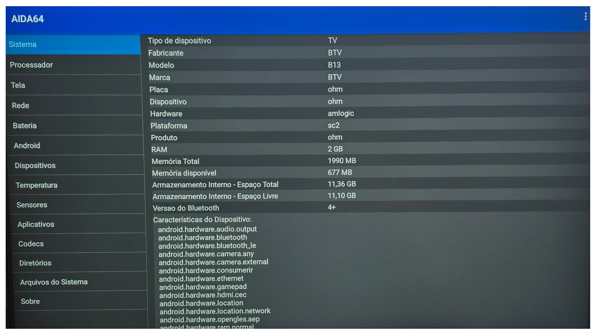
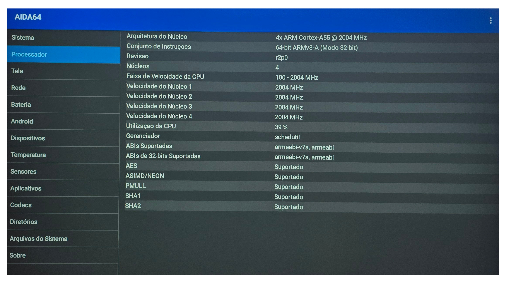
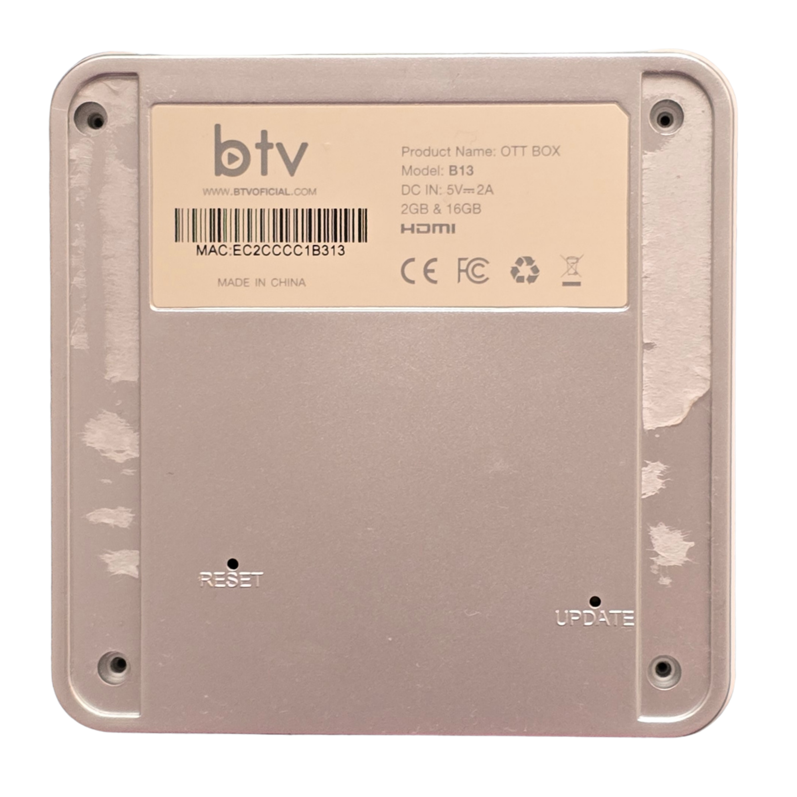
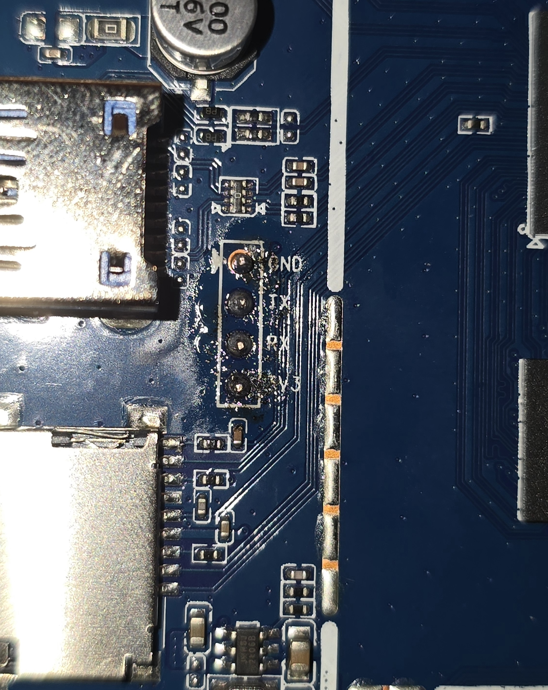
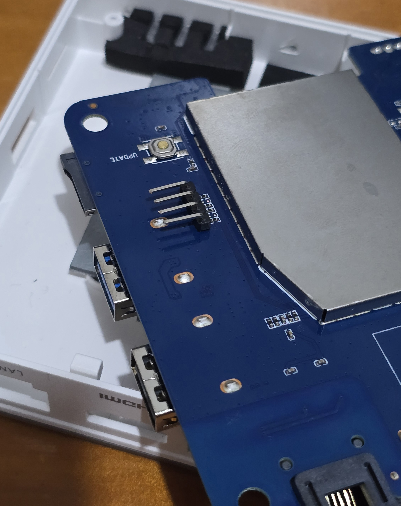
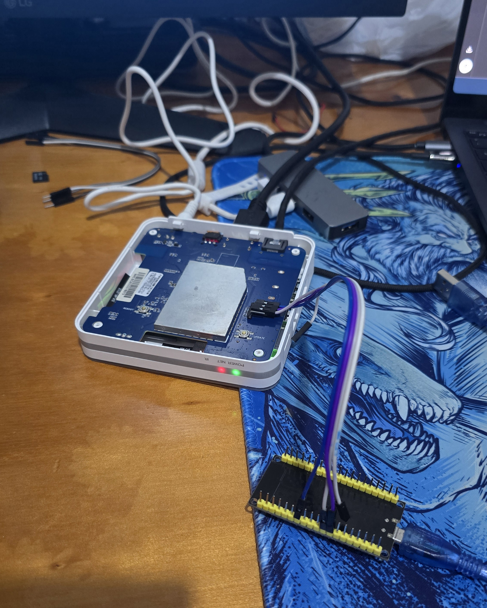

# Tutorial — Debian autônomo no eMMC da BTV B13 (Amlogic S905X4)

Procedimento passo a passo pra fazer uma TV Box BTV B13 bootar **Debian 13 + XFCE direto do eMMC interno** — sem pendrive permanente, sem toothpick toda vez. Funciona a frio: liga na tomada → Debian em ~5 segundos.

**Versão do tutorial:** 2.0 (atualizado em 18/05/2026)

---

## O que você vai ter no final

- Debian 13 (Trixie) com kernel mainline 6.18 rodando do eMMC
- XFCE com aceleração GPU (Mali-G31 via Panfrost)
- SSH e ethernet funcionando (100 Mbps)
- Boot autônomo: ligar e pronto
- **NÃO** vão funcionar (por enquanto): WiFi, Bluetooth, áudio HDMI, controle remoto (que é BT na B13)

---

## Hardware necessário

| Item | Notas |
|---|---|
| TV Box **BTV B13** com Amlogic **S905X4 (SC2)** | Confirme abrindo o caso (serigrafia `B13_V1.0_20220406`) ou via AIDA64 no Android original. CPU deve aparecer como Cortex-A55 |
| Pendrive 4-8GB (qualquer um) | Pra gravação inicial da imagem devmfc. **Na B13** funciona em qualquer porta USB (2.0 ou 3.0). **Na E13** funciona só na porta marcada `OTG` na placa |
| **ESP32 + jumpers** (~R$30) | Adaptador UART pra acessar o u-boot vendor. Vai precisar **soldar pinos macho** nos pads UART da placa B13 (vêm só com furos) |
| Computador com Windows, Linux ou Mac | Pra gravar imagem (Balena Etcher é multiplataforma), compilar scripts, SSH |
| Cabo ethernet | WiFi não funciona no Debian — ethernet é obrigatório |
| Toothpick / alfinete / agulha / jumper macho / chavinha SIM / broca fina | Pra apertar o botão **UPDATE** (furo embaixo da TV box). Diâmetro do furo: ~2mm — qualquer coisa mais grossa não entra. Comprimento mínimo: ~1.5cm pra alcançar e pressionar o botão. **Alternativa:** abrir a carcaça (sem parafuso visível, é encaixe) e apertar o botão direto com o dedo, bem mais fácil |
| Teclado USB | Pro Debian inicial. **NÃO** usar mouse gamer 8K (Xorg satura) — usa mouse comum 125 Hz |
| Monitor + cabo HDMI | Pra ver o que tá fazendo |

---

## Fase 0 — Identificação e backup do Android original

### 0.1 Confirma que é mesmo uma B13

Abre a carcaça (encaixe, sem parafuso) e procura na placa a serigrafia:
- **`B13_V1.0_20220406`** (versão e data de fabricação)
- **Chip SoC central marcado "S905X4"**

Alternativa sem abrir: instala o app **AIDA64** pela Play Store no Android original e checa:
- Processador: deve mostrar **4× ARM Cortex-A55 @ 2004 MHz**
- Plataforma: **amlogic / sc2 / ohm**
- RAM: 2 GB
- Armazenamento: 16 GB (mostrado como 11.36 GB total — resto são partições vendor)

Referência de como devem aparecer no AIDA64:




### 0.2 Faça o backup do Android (CRÍTICO)

**Sem backup, se algo der errado, a B13 vira tijolo.**

Opções:
- **App de backup no Android original** (procurar SAC ou fóruns BTV)
- **Amlogic USB Burning Tool** no Windows pra fazer dump completo do eMMC

Guarda o `.img` em local seguro. Esse é seu seguro contra qualquer erro neste tutorial.

> Tutorial detalhado de backup: <https://github.com/educabox/educabox/blob/main/boxes/btv11.md>

---

## Fase 1 — Pendrive Devmfc Debian

### 1.1 Baixar a imagem

Repositório: <https://github.com/devmfc/debian-on-amlogic>

Procure a release mais recente, baixe a imagem genérica para Amlogic S905X4. Algo tipo:
`Debian_trixie_amlogic-s905x4_xfce_X.X.X.img.xz`

### 1.2 Gravar no pendrive

**Opção A — Balena Etcher (Windows / Mac / Linux):**

1. Baixa de <https://etcher.balena.io/>
2. Abre o Etcher
3. "Flash from file" → seleciona o `.img.xz` baixado (Etcher descomprime automaticamente)
4. "Select target" → escolhe o pendrive
5. "Flash!"

Mais simples e funciona em qualquer SO.

**Opção B — Linux via dd:**

```bash
xz -d Debian_trixie_amlogic-s905x4_xfce_X.X.X.img.xz
sudo dd if=Debian_trixie_amlogic-s905x4_xfce_X.X.X.img of=/dev/sdX bs=4M status=progress conv=fsync
sync
```

Substitua `/dev/sdX` pelo seu pendrive (confirma com `lsblk` antes — gravar no disco errado destrói dados).

### 1.3 Configurar boot.config

Monte a partição BOOT do pendrive (FAT32), edite o `boot.config` e **descomente apenas a linha**:

```
box=s905x4_generic
```

⚠️ **NÃO** use `box=s905x4_generic_gigabit` — a B13 é 100M por hardware (não tem PHY gigabit externo), e essa config faz o boot falhar.

### 1.4 Boot pelo pendrive (botão UPDATE)

1. Desligue a B13 da tomada
2. Plugue o pendrive em uma porta USB. Na B13 funciona tanto na USB 2.0 quanto na USB 3.0 — testei o procedimento todo na 3.0 sem problema
3. Plugue teclado e monitor HDMI
4. **Vire a TV box de cabeça pra baixo.** Embaixo tem dois furos com texto em alto relevo no plástico: **RESET** e **UPDATE**. Usaremos o **UPDATE**

   
   *Vista da parte de baixo da B13. Os dois furos pequenos (~2mm) estão nos cantos inferiores: RESET à esquerda, UPDATE à direita. Os 4 furos maiores nos cantos são pra parafusos da carcaça.*
5. Pegue o toothpick (ou alfinete, agulha, jumper macho, chavinha SIM...) e enfie no furo do **UPDATE**. O botão fica ~1.5 cm pra dentro. Se preferir, abre a carcaça (sem parafuso, é encaixe) e aperta direto com o dedo
6. **Segure o botão UPDATE pressionado** e ligue a B13 na tomada
7. Continue segurando por 7-10 segundos depois de ligar
8. Solte. Debian deve começar a bootar do pendrive

Login default: `root` / `tvbox`

Confirma que tá rodando:
```bash
uname -r              # 6.18.x-meson64
cat /proc/device-tree/model    # Amlogic SC2 AH212 Development Board
df /                  # rootfs em /dev/sda2
ip a                  # eth0 deve pegar IP
```

---

## Fase 2 — Backups de segurança ANTES de mexer no eMMC

⚠️ **Esta fase é OPCIONAL mas FORTEMENTE RECOMENDADA.** Sem esses backups, se algo der errado nas próximas fases, a B13 pode virar tijolo permanente.

```bash
# Backup do bootloader (4 MB - u-boot original)
dd if=/dev/mmcblk1 bs=512 count=8192 of=/root/u-boot-original-backup.img status=progress

# Backup da partição env (8 MB - ANTES de modificar com saveenv)
dd if=/dev/mmcblk1 bs=512 skip=1875968 count=16384 of=/root/uboot-env-area-backup.img status=progress

# Backup da factory partition / KEYBOX (8 MB - chaves DRM do Android)
dd if=/dev/mmcblk1 bs=512 skip=2011136 count=16384 of=/root/factory-keybox-backup.img status=progress

# Backup dos primeiros 16 MB (cobre quase todas partições vendor pequenas)
dd if=/dev/mmcblk1 bs=1M count=16 of=/root/emmc-first-16mb-backup.img status=progress

# Confere
ls -la /root/*.img
md5sum /root/*.img > /root/backups.md5
```

**Copie esses 4 arquivos `.img` pro seu PC** (via `scp` ou pendrive). Não deixe só no eMMC — se o eMMC quebrar, os backups morrem junto.

---

## Fase 3 — Preparar eMMC do zero

⚠️ **Esta fase apaga o Android original do eMMC.** Tenha certeza que tem backup (Fase 0 + Fase 2).

### 3.1 Particionar o eMMC

```bash
# Confirma que /dev/mmcblk1 é o eMMC interno (não confunda com mmcblk0 = SD)
lsblk
fdisk -l /dev/mmcblk1

# Cria nova tabela MBR com 2 partições alinhadas com o layout vendor AML:
sfdisk /dev/mmcblk1 << 'EOF'
label: dos
device: /dev/mmcblk1
unit: sectors

/dev/mmcblk1p1 : start=2764800, size=3276800, type=c, bootable
/dev/mmcblk1p2 : start=6057984, size=24727552, type=83
EOF

sync; partprobe /dev/mmcblk1; ls /dev/mmcblk1p*
```

A mágica está nos offsets: `2764800` e `6057984` batem com o início das partições vendor `super` e `userdata`. Isso permite que o u-boot vendor leia a FAT32 via `mmc 1:15` hex (= partição 21 = "super") sem precisar entender MBR.

### 3.2 Formatar

```bash
mkfs.vfat -F 32 -n BOOT /dev/mmcblk1p1
mkfs.ext4 -L rootfs /dev/mmcblk1p2
```

### 3.3 Copiar /boot e rootfs

```bash
mkdir -p /mnt/emmc-boot /mnt/emmc-root
mount /dev/mmcblk1p1 /mnt/emmc-boot
mount /dev/mmcblk1p2 /mnt/emmc-root

# Copia /boot do pendrive (atualmente em /boot, vindo do sda1)
cp -av /boot/* /mnt/emmc-boot/
sync

# Copia rootfs (exceto pontos de montagem e dirs especiais)
rsync -axHAX --info=progress2 --exclude={/dev/*,/proc/*,/sys/*,/tmp/*,/run/*,/mnt/*,/media/*,/lost+found} / /mnt/emmc-root/
sync
```

### 3.4 Ajustar /etc/fstab no eMMC

```bash
BOOT_UUID=$(blkid -s UUID -o value /dev/mmcblk1p1)
ROOT_UUID=$(blkid -s UUID -o value /dev/mmcblk1p2)

cat > /mnt/emmc-root/etc/fstab << EOF
UUID=$ROOT_UUID  /      ext4  defaults,noatime  0 1
UUID=$BOOT_UUID  /boot  vfat  defaults,umask=077  0 2
EOF

cat /mnt/emmc-root/etc/fstab
```

### 3.5 Ajustar boot.config da partição /boot do eMMC

Edite `/mnt/emmc-boot/boot.config` e garante que aponta pro eMMC:
```
box=s905x4_generic
```
(Mesma config do pendrive — `box=` é o mesmo nome. Lembra: **NÃO** use `_gigabit`.)

---

## Fase 4 — Gravar emmc_autoscript na factory partition

Esta é a parte que faz o vendor u-boot bootar do eMMC sozinho.

### 4.1 Compilar o emmc_autoscript_full

Pegue o source `emmc_autoscript_full.src` (anexo deste tutorial) e:

```bash
apt install -y u-boot-tools
cd /root
# (salvar o emmc_autoscript_full.src aqui antes)
mkimage -C none -A arm -T script -d emmc_autoscript_full.src emmc_autoscript_full
ls -la emmc_autoscript_full   # ~900 bytes
mkimage -l emmc_autoscript_full
```

### 4.2 Gravar na factory partition (mmc 1:6)

```bash
mkdir -p /mnt/factory
mount -t vfat -o loop,offset=1029701632,sizelimit=8388608 /dev/mmcblk1 /mnt/factory
ls /mnt/factory/

cp emmc_autoscript_full /mnt/factory/emmc_autoscript
sync

# Verifica
ls -la /mnt/factory/emmc_autoscript
md5sum emmc_autoscript_full /mnt/factory/emmc_autoscript    # devem bater
umount /mnt/factory
sync
```

> Os números mágicos: `1029701632` é o offset em bytes da partição "factory" (mmc 1:6 no schema AML, sector 2011136 × 512). `8388608` é o tamanho de 8MB. A partição é FAT12 com label "KEYBOX PART", originalmente destinada a chaves DRM do Android — a gente sequestra ela.

---

## Fase 5 — Modificar env do u-boot via UART

Esta é a etapa que faz `start_emmc_autoscript` apontar pra factory partition e persiste a config.

### 5.1 Soldar pinos macho nos pads UART (uma vez só)

A placa B13 tem 4 furos UART expostos do lado das portas USB, em coluna, com serigrafia:
```
GND
TX
RX
3V3
```


*Close-up dos 4 pads UART com solda aplicada nos furos (ainda sem os pinos macho instalados). Ordem de cima pra baixo: GND, TX, RX, 3V3.*

Como vêm só com furos (sem pinos), você precisa **soldar pinos macho** (header de 4 pinos, mesmo padrão de Arduino) pra conseguir conectar jumpers do ESP32. Ferro de solda + estanho. Operação de 5 minutos.


*Depois da solda: os 4 pinos macho ficam pra cima, prontos pra receber jumpers fêmea-fêmea ou fêmea-macho. A solda não precisa ser estética — só elétrica. Note o botão UPDATE serigrafado logo acima dos pinos.*

### 5.2 Setup do ESP32 como adaptador UART

Pegue o sketch `esp32-uart-bridge.ino` (anexo). Upload no ESP32 via Arduino IDE.

Wiring:
```
ESP32 GND     ─── BTV GND
ESP32 GPIO16  ─── BTV TX
ESP32 GPIO17  ─── BTV RX
```

**Não ligue VCC entre ESP32 e BTV.** Alimentação separada.

### 5.3 Conectar e ligar

1. Plugue ESP32 no PC via USB
2. Abra Serial Monitor a **115200 baud**
3. Ligue a B13 — vai aparecer o log de boot do u-boot vendor


*Setup esperado quando tudo está conectado: B13 com a tampa removida, jumpers ligando UART da placa ao ESP32, ESP32 conectado ao PC via USB. Os LEDs frontais POWER (vermelho) e IR (verde) acesos confirmam que a B13 está alimentada e rodando.*
4. Quando aparecer `Hit any key to stop autoboot:`, digite qualquer tecla **rapidamente** (a janela é de milissegundos — se a janela for muito curta, use a versão Auto-Intercept v2 do sketch comentada no .ino)
5. Vai cair no prompt `sc2_ah212#`

### 5.4 Comandos no prompt u-boot

Cole **um comando por linha** (não tudo de uma vez):

```
setenv start_emmc_autoscript 'if fatload mmc 1:6 1020000 emmc_autoscript; then autoscr 1020000; fi;'
```

Confere:
```
printenv start_emmc_autoscript
```

Esperado: `start_emmc_autoscript=if fatload mmc 1:6 1020000 emmc_autoscript; then autoscr 1020000; fi;`

Testa rodando manualmente:
```
run start_emmc_autoscript
```

Se aparecer `bootscript carregado do eMMC (mmc 1:15)!` seguido de boot do kernel → funcionou! Espera o Debian subir, faz login, valida.

Se funcionou, volta no u-boot (`reset`, intercept de novo, ou roda o comando direto sem testar — você pode pular `run` se confiar) e **persiste**:

```
setenv start_emmc_autoscript 'if fatload mmc 1:6 1020000 emmc_autoscript; then autoscr 1020000; fi;'
saveenv
```

Esperado: `Saving Environment to MMC... Writing to MMC(0)... OK`

---

## Fase 6 — Teste de boot autônomo

1. **Desconecte tudo**: pendrive USB, ESP32, teclado (se quiser)
2. Tira o cabo de força da B13
3. Espera 5 segundos
4. Liga de novo — **sem toothpick, sem nada**

Deve bootar Debian em ~5s. Login via SSH funcionando, XFCE no monitor.

Se não bootar: plugga o pendrive de volta + toothpick. Sistema do pendrive vai rodar. Aí investiga o erro (provavelmente `mmc 1:6` ou env não persistiu).

---

## Otimizações XFCE (opcionais mas recomendadas)

Por padrão o XFCE fica engasgado nessa BTV. Esses ajustes resolvem ~90% do lag.

### Governor da GPU em performance

Cria `/etc/systemd/system/gpu-performance.service` com o conteúdo do anexo. Depois:
```bash
systemctl daemon-reload
systemctl enable --now gpu-performance.service
cat /sys/class/devfreq/fe400000.gpu/cur_freq   # esperado: 846000000
```

A Mali-G31 vai pular de 285 MHz pra 846 MHz (3x). Sem isso, o XFCE fica engasgado porque o devfreq governor padrão (`simple_ondemand`) não rampa o clock pra cargas leves de UI.

### Xorg com DRI3 + PageFlip + glamor

Cria `/etc/X11/xorg.conf.d/20-meson.conf` com o conteúdo do anexo. Reinicia:
```bash
systemctl restart lightdm
```

### Compositor XFWM4 com vsync

Como **usuário comum** (não root) na sessão XFCE:
```bash
xfconf-query -c xfwm4 -p /general/use_compositing -s true
xfconf-query -c xfwm4 -p /general/sync_to_vblank -n -t bool -s true
xfconf-query -c xfwm4 -p /general/unredirect_overlays -s true
```

(`-n -t bool` é necessário em `sync_to_vblank` porque a propriedade pode não existir ainda.)

### Bônus: melhorar a dissipação térmica

Se você abrir a carcaça e olhar o verso da placa, vai ver um EMI shield de metal grande sobre o SoC. Esse shield frequentemente tem **folga sobre o chip** — é projetado pra blindagem eletromagnética, não pra dissipação.

**Apertar manualmente** o shield contra o SoC já melhora 5-7°C. **Solução permanente:** thermal pad fino (1-1.5mm, R$15-25 no Mercado Livre) entre SoC e shield. Vale a pena pra uso 24/7 como servidor.

---

## Casos de uso reais da B13 depois disso tudo

Honestidade plena:

**✅ Funciona bem como servidor:**
- Pi-hole / AdGuard Home (DNS filter)
- Home Assistant
- MQTT broker (Mosquitto)
- SSH bastion / jump host
- Docker leve (1-2 containers pequenos)
- Node de cluster K3s pra estudo
- Cron jobs, backups automatizados, monitoramento

**⚠️ Funciona com limitações:**
- Servidor de arquivos LAN pequena (rede 100M = 12 MB/s teto)
- WireGuard VPN (CPU é gargalo na crypto, ~30-50 Mbps)

**❌ NÃO serve pra:**
- Desktop com Firefox/Chromium (CPU satura em 1-2 abas + YouTube)
- Mediabox 4K (sem decode hardware no Mesa mainline)
- Servidor de mídia com transcoding (Jellyfin/Plex)
- Workstation Linux normal

---

## Troubleshooting

### Boot autônomo não funciona, fica preto

Reverter via toothpick + pendrive antigo, depois:
```bash
# Verifica que o emmc_autoscript existe e tá íntegro
mount -t vfat -o loop,offset=1029701632,sizelimit=8388608 /dev/mmcblk1 /mnt/factory
ls -la /mnt/factory/emmc_autoscript
mkimage -l /mnt/factory/emmc_autoscript
umount /mnt/factory

# Confirma via UART que o env persistiu
# (boot, intercept, printenv start_emmc_autoscript)
```

Se o env não persistiu (saveenv falhou), use o backup `uboot-env-area-backup.img`:
```bash
dd if=uboot-env-area-backup.img of=/dev/mmcblk1 bs=512 seek=1875968 conv=fsync
```

### Boot fica em loop com "Unrecognized filesystem type"

Você provavelmente usou `box=s905x4_generic_gigabit` em vez de `_generic`. A B13 é 100M por hardware. Corrige no `boot.config` e reflasha o pendrive (ou edita direto no /boot do eMMC).

### "Tearing" leve ao arrastar janelas no XFCE

Conhecido. A combinação Mali-G31 + meson-drm + glamor não tem page-flip atômico perfeito. Tearing leve é o estado da arte hoje. Pra eliminar 100% precisaria patchear DTB ou esperar driver melhor.

### XFCE engasgando depois de tudo configurado

Verifica:
1. GPU governor: `cat /sys/class/devfreq/fe400000.gpu/governor` → deve ser `performance`
2. Renderer: `glxinfo | grep Renderer` → deve ser `Mali-G31 (Panfrost)`
3. **Não usa mouse gamer 8K** — mouses de polling acima de 1000 Hz saturam o Xorg nessa CPU
4. Xorg CPU: `ps aux | grep Xorg` → idle ~10%, em uso ~30%
5. Temperatura: `cat /sys/class/thermal/thermal_zone*/temp` → < 70°C

### Firefox/navegador trava ao abrir YouTube

Esperado. A B13 não tem decodificação de vídeo hardware integrada ao Mesa, então decodifica em software → CPU 100% sustentado → trava. Use a B13 como servidor, não como desktop de mídia.

### WiFi não funciona

O chip wifi é Unisoc UWE5621DS SDIO. Driver out-of-tree existe (`CoreELEC/uwe5631-aml`) mas o chip não responde com ID válido no DTB genérico AH212 — falta power-on no DTB. **Soluções:**
1. Dongle USB WiFi (RTL8188FU, MT7601U, ~R$20) — funciona plug & play, recomendado
2. Patchear DTB com nó wifi específico do BTV B13 — trabalhoso

### Controle remoto da TV box não funciona

Esperado. O controle da B13 é Bluetooth, e o BT (mesmo chip Unisoc UWE5621DS) não funciona no Debian atual. Use teclado/mouse USB ou SSH pra controlar.

### Áudio HDMI não funciona

Esperado. Driver `meson-aiu` mainline tem suporte parcial pra S905X4 SC2. **Workarounds possíveis:**
- Áudio analógico via jack 3.5mm (porta AV, não testado)
- Áudio S/PDIF óptico (porta existe, não testado)
- USB DAC externo
- Pra servidor headless, irrelevante (não precisa de áudio)

---

## Anexos

Arquivos disponíveis junto deste tutorial:

- `bootscript-amlboot.src` — bootscript patched (alternativa via pendrive ao invés de UART, projeto futuro)
- `emmc_autoscript_full.src` — script u-boot do boot autônomo do eMMC
- `gpu-performance.service` — systemd unit pra GPU em performance
- `20-meson.conf` — config do Xorg
- `esp32-uart-bridge.ino` — sketch do ESP32 como adaptador UART
- `aml_autoscript_debug.src` — script de diagnóstico (fóssil da investigação)
- `aml_autoscript_emmc_only.src` — script multiboot devmfc (fóssil da investigação)

---

## Créditos

Procedimento desenvolvido por **Gabriel Lima** com assistência de Claude (Anthropic) em sessão de 12+ horas em 15/05/2026, com atualizações em 18/05/2026. Baseado no trabalho do projeto [devmfc/debian-on-amlogic](https://github.com/devmfc/debian-on-amlogic) como ponto de partida.

Para narrativa completa do processo, descobertas técnicas, benchmarks e lições aprendidas: ver `DIARIO.md`.
